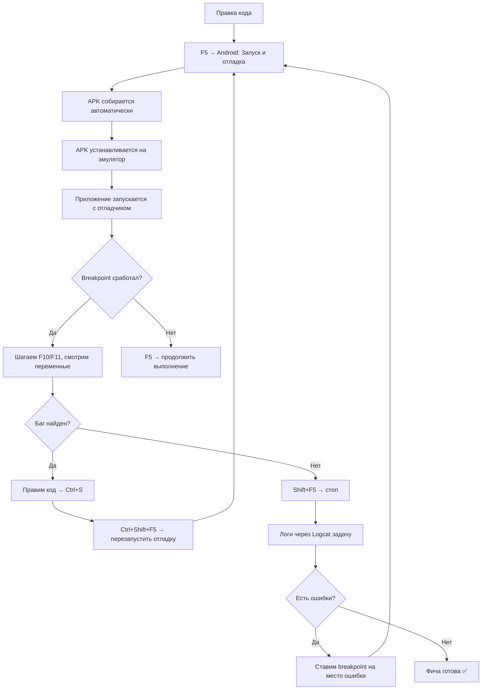

# Настройка отладки Android в VS Code

**Версия:** 0.3.0 | **AVD:** PrologyEmulator (Android 14, API 34) | **SDK:** 28–35

---

## 1. Расширения (Extensions)

Установлены и настроены в `.vscode/extensions.json`. Основные:

| Расширение | ID | Зачем |
|---|---|---|
| **Android Dev Extension** | `adelphes.android-dev-ext` | Главный отладчик: breakpoints, step-through, переменные |
| **ADB Interface** | `vinicioslc.adb-interface-vscode` | ADB-команды из палитры: установка APK, Wi-Fi, скриншоты |
| **Emulator Launcher** | `343max.android-emulator-launcher` | Запуск AVD одной командой |
| **Gradle** | `vscjava.vscode-gradle` | Gradle-задачи в дереве Explorer |
| **Kotlin** | `fwcd.kotlin` | Подсветка и автодополнение Kotlin |

Установка недостающих:
```bash
code --install-extension <publisher.extension>
# пример: code --install-extension adelphes.android-dev-ext
```

---

## 2. Быстрый старт

### 2.1 Запустить эмулятор

| Способ | Действие |
|---|---|
| **Через задачу** | `Ctrl+Shift+P` → «Tasks: Run Task» → «Android: Запустить AVD (PrologyEmulator, quick boot)» |
| **Через расширение** | `Ctrl+Shift+P` → «Launch Android Emulator» → выбери PrologyEmulator |
| **Через терминал** | `emulator -avd PrologyEmulator -no-snapshot-load` |

### 2.2 Установить и отладить

**Вариант A — отладка одной кнопкой (F5):**
1. Убедись, что эмулятор запущен (иконка в строке состояния)
2. Поставь breakpoint (`F9`) в нужном месте
3. Нажми `F5` → выбери **«Android: Запуск и отладка»**
4. Расширение соберёт APK, установит на эмулятор, запустит и подключит отладчик

**Вариант B — ручная установка:**
1. `Ctrl+Shift+P` → «Tasks: Run Task» → **«Android: Собрать Debug APK»**
2. `Ctrl+Shift+P` → «Tasks: Run Task» → **«Android: Установить APK и запустить»**
3. `Ctrl+Shift+P` → «Tasks: Run Task» → **«Android: Logcat (Equalizer314)»**

**Вариант C — полный цикл:**
- `Ctrl+Shift+P` → «Tasks: Run Task» → **«Android: Полный цикл (AVD → сборка → установка → logcat)»**
- Всё сделает автоматически: запустит эмулятор, соберёт APK, установит, запустит и откроет логи

### 2.3 Подключиться к запущенному приложению

Если приложение уже работает:
1. `Ctrl+Shift+D` → выбери конфигурацию **«Android: Attach к процессу»**
2. Нажми `F5` — отладчик подключится без перезапуска

---

## 3. Композитные конфигурации отладки (compounds)

В `launch.json` есть **«Android: Полный цикл (сборка + установка + отладка)»**:
- Запускает `Gradle: Собрать Debug APK`
- Затем `Android: Запуск и отладка` (установка + запуск + отладчик)

Используй когда хочешь всё одной кнопкой: выбери compound в выпадающем списке Run → `F5`.

---

## 4. Управление приложением (задачи)

| Задача | Действие | Когда |
|---|---|---|
| **Установить APK и запустить** | Сборка + установка + запуск | Повседневная установка |
| **Переустановить APK (clean install)** | `uninstallDebug` + `installDebug` | Чистая установка после смены package name |
| **Очистить данные приложения** | `pm clear` | Сброс БД/SharedPreferences |
| **Остановить приложение** | `am force-stop` | Принудительное завершение |
| **Перезапустить приложение** | force-stop + install + запуск | Полный перезапуск с новой версией |

---

## 5. Диагностика

### 5.1 Логи (Logcat)

| Задача | Показывает |
|---|---|
| **Logcat (Equalizer314)** | Только теги EqService, MainActivity, MbcActivity, LimiterActivity |
| **Logcat (все, verbose)** | Все логи системы |
| **Logcat (ошибки только)** | Только Error и Fatal |

### 5.2 Другие диагностические задачи

| Задача | Описание |
|---|---|
| **Список устройств ADB** | Показать все подключённые девайсы |
| **Проверить AVD запущен** | Быстрая проверка эмулятора |
| **Bugreport** | Полный дамп для отладки сложных проблем |
| **Pull all traces** | Выгрузить ANR-трейсы и heap dumps |
| **Снять скриншот** | Скриншот эмулятора → в корень проекта |
| **Записать видео экрана** | 30-секундная запись экрана |

### 5.3 Advanced: расширенная диагностика

```bash
# CPU/memory профиль приложения
adb shell dumpsys meminfo com.bearinmind.equalizer314

# Активности в стеке
adb shell dumpsys activity activities | grep Equalizer

# Сервисы
adb shell dumpsys activity services | grep Equalizer

# Broadcast receivers
adb shell dumpsys activity broadcasts | grep equalizer

# Текущая аудиосессия
adb shell dumpsys media_session | grep equalizer
```

---

## 6. Foreground Service и отладка

Equalizer314 — foreground service (`EqService`). При отладке:

1. **Обычный F5 работает** — отладчик подключается к Activity, сервис запускается как обычно
2. **Для отладки сервиса с запуска:**
   - Поставь breakpoint в `EqService.onCreate()` или `onStartCommand()`
   - Запусти через F5 — Activity запустит сервис, отладчик остановится на breakpoint
3. **Если сервис «молча» падает:**
   - Задача **«Logcat (Equalizer314)»** покажет `EqService:D`
   - Если не помогло — **«Logcat (все, verbose)»** и ищи `FATAL EXCEPTION`
4. **Watchdog Session-0:**
   - Если EQ отключается через 5–30 мин фоновой работы — проверь `VisualizerHelper` логи
   - Баг Android: система «тихо убивает» аудиосессию 0, watchdog пересоздаёт

---

## 7. Расширения для ADB (adb-interface-vscode)

Расширение `vinicioslc.adb-interface-vscode` добавляет в палитру команд (`Ctrl+Shift+P`):

| Команда | Что делает |
|---|---|
| `ADB: Install APK` | Установить APK |
| `ADB: Uninstall App` | Удалить приложение |
| `ADB: Screenshot` | Скриншот |
| `ADB: Screen Record` | Запись экрана |
| `ADB: Wireless debugging` | Подключение по Wi-Fi |
| `ADB: FireBase Debug` | Firebase DebugView |

Удобно для быстрых операций без навигации по задачам.

---

## 8. Scrcpy — зеркалирование экрана

**Расширение:** `ihsanis.scrcpy` (установлено)
**Системная утилита:** `scrcpy` 3.3.4 (установлена)

Scrcpy показывает экран Android-устройства в отдельном окне и позволяет управлять им с мыши/клавиатуры. Полезно для:
- Демонстрации работы приложения без эмулятора
- Тестирования на физическом устройстве
- Записи видео для отчётов о багах

### 8.1 Запуск

| Способ | Действие |
|---|---|
| **Через задачу VS Code** | `Ctrl+Shift+P` → «Tasks: Run Task» → **«Android: Scrcpy (зеркало экрана)»** |
| **Через расширение** | `Ctrl+Shift+P` → «Scrcpy: Start» |
| **Через терминал** | `scrcpy --window-title 'Equalizer314' --max-size 1024` |

### 8.2 Варианты задач scrcpy

| Задача | Флаги | Назначение |
|---|---|---|
| **Scrcpy (зеркало экрана)** | `--max-size 1024` | Стандартный режим: управление + звук |
| **Scrcpy (без звука, без управления)** | `--no-control --no-audio` | Только просмотр — не перехватывает ввод |
| **Scrcpy (высокое качество, 60fps)** | `--bit-rate 20M --max-fps 60` | Для плавной записи демо |

### 8.3 Полезные флаги scrcpy

```bash
# Запись видео (на компьютере, а не на устройстве)
scrcpy --record file.mp4

# Отключить выключение экрана устройства
scrcpy --turn-screen-off

# Указать конкретное устройство (если подключено несколько)
scrcpy --serial emulator-5554

# Полноэкранный режим
scrcpy --fullscreen

# Без рамки окна
scrcpy --window-borderless

# Фиксированный размер окна (ширина)
scrcpy --max-size 800
```

### 8.4 Требования

1. **USB-отладка включена** на устройстве
2. **ADB видит устройство:** `adb devices -l`
3. Для работы через Wi-Fi: `adb tcpip 5555` → отключить USB → `adb connect <IP>:5555`

---

## 9. Рабочий процесс «отладка фичи»



### Оптимизация итерации:

| Этап | Время | Инструмент |
|---|---|---|
| Изменить код | ~5 сек | VS Code редактор |
| Пересобрать и запустить | ~30–90 сек | `F5` (compound: сборка + отладка) |
| **Горячая перезамена кода** (Hot Code Replace) | ~3 сек | Отладчик → изменить код → `Ctrl+S` → продолжить (`F5`) |

> **Hot Code Replace:** при отладке через `adelphes.android-dev-ext` можно менять тело методов прямо во время сессии. Код перекомпилируется на лету. Не работает для: новых методов, новых классов, изменения сигнатур.

---

## 9. Troubleshooting

### Эмулятор не запускается

```bash
# Проверить, что AVD существует
emulator -list-avds

# Проверить пути SDK
echo $ANDROID_SDK_ROOT
ls ~/Android/Sdk/emulator/emulator

# Запуск с verbose-логами
emulator -avd PrologyEmulator -verbose -show-kernel

# Если ошибка "Intel HAXM is not installed" — включи KVM
# Для Linux: sudo apt install qemu-kvm && sudo adduser $USER kvm
```

### ADB не видит устройство

```bash
adb kill-server && adb start-server
adb devices -l
# Если всё равно пусто — перезапусти эмулятор
# Или: adb connect localhost:5555
```

### Отладчик не подключается

1. Проверь, что APK собран в debug-режиме: `./gradlew assembleDebug`
2. Убедись, что в `build.gradle.kts` нет `debuggable false` в debug-конфигурации
3. В launch.json проверь `apkFile` — путь должен совпадать с актуальным:
   ```bash
   find app/build/outputs/apk -name "*.apk" 2>/dev/null
   ```
4. Проверь, что расширение `adelphes.android-dev-ext` активировано:
   - `Ctrl+Shift+X` → поищи «android-dev-ext» → оно должно быть включено
5. Если используется compound — проверь, что `preLaunchTask` ссылается на сущестующую задачу

### Логи не отображаются

```bash
# Сбросить буфер
adb logcat -c
# Фильтр по конкретному тегу
adb logcat -s EqService:* MainActivity:*
# Фильтр по PID приложения
adb shell ps | grep equalizer  # получить PID
adb logcat --pid=<PID>
```

### Foreground Service убивается системой

Android 13+ может убивать foreground service если не показано уведомление:
- Убедись, что `NotificationChannel` создан ДО `startForegroundService()`
- Проверь канал в настройках: Настройки → Приложения → Equalizer314 → Уведомления
- Если канал отключён пользователем — сервис будет убит

---

## 10. Полезные комбинации клавиш

| Клавиши | Что делают |
|---|---|
| `F5` | Запуск/продолжение отладки |
| `Shift+F5` | Остановка отладки |
| `Ctrl+Shift+F5` | Перезапуск отладки |
| `F9` | Поставить/снять breakpoint |
| `F10` | Шаг с обходом (Step Over) |
| `F11` | Шаг с входом (Step Into) |
| `Shift+F11` | Шаг с выходом (Step Out) |
| `Ctrl+K Ctrl+I` | Показать подсказку |
| `Ctrl+Shift+P` | Палитра команд |
| `` Ctrl+` `` | Терминал |
| `Ctrl+Shift+` ` | Создать новый терминал |

---

## 11. Структура .vscode/

```
.vscode/
├── extensions.json       # Рекомендуемые расширения
├── launch.json           # Конфигурации отладчика (8 профилей)
├── tasks.json            # Автоматизация (25+ задач)
├── settings.json         # Настройки рабочей области
└── ANDROID_DEBUG_GUIDE.md  # Этот файл
```

### Файлы для самостоятельного изменения

- **`launch.json`**: `apkFile` — если изменился путь к APK; `launchActivity` — если другой экран для отладки
- **`settings.json`**: `java.jdt.ls.java.home` — если другой JDK
- **`tasks.json`**: команды `emulator -avd ...` при добавлении нового AVD; `ANDROID_SDK_ROOT` при смене пути
