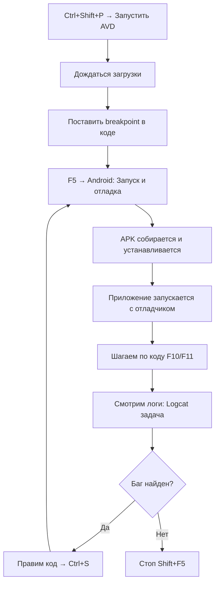

# Настройка отладки Android в VS Code

## Быстрый старт

### 1. Запустить эмулятор

**Вариант A — через задачу VS Code (tasks.json):**
1. Нажми `Ctrl+Shift+P` → «Tasks: Run Task»
2. Выбери **«Android: Запустить AVD (PrologyEmulator, quick boot)»**
3. Дождись загрузки (зелёный статус в терминале)

**Вариант B — через расширение Android Emulator Launcher:**
1. Нажми `Ctrl+Shift+P` → «Launch Android Emulator»
2. Выбери AVD «PrologyEmulator»

**Вариант C — через терминал:**
```bash
emulator -avd PrologyEmulator -no-snapshot-load
```

### 2. Установить и запустить приложение

**Вариант A — отладка через расширение Android Dev Extension:**
1. Нажми `F5` (или `Ctrl+Shift+D` → выбери **«Android: Запуск и отладка»**)
2. Расширение само соберёт APK, установит на устройство и подключит отладчик

**Вариант B — установка через задачу:**
1. `Ctrl+Shift+P` → «Tasks: Run Task» → **«Android: Установить APK и запустить»**
2. Для чистой переустановки: **«Android: Переустановить APK (clean install)»**

**Вариант C — ручная установка:**
```bash
./gradlew installDebug
adb shell monkey -p com.bearinmind.equalizer314 1
```

### 3. Подключить отладчик

Если приложение уже запущено:
1. `Ctrl+Shift+D` → выбери **«Android: Attach к процессу»** → `F5`
2. Расширение adelphes.android-dev-ext подключится к процессу

### 4. Просмотр логов

- **Логи только Equalizer314:** `Ctrl+Shift+P` → «Tasks: Run Task» → **«Android: Logcat (Equalizer314)»**
- **Все логи:** задача **«Android: Logcat (все, verbose)»**
- **Через расширение:** `Ctrl+Shift+P` → «Android: View Logcat»
- **Через терминал:** `adb logcat -v threadtime com.bearinmind.equalizer314:D *:S`

---

## Все задачи VS Code (tasks.json)

### Запуск эмулятора
| Задача | Когда использовать |
|--------|------------------|
| **Android: Запустить AVD (PrologyEmulator, cold boot)** | Первый запуск или после смены системного образа. Стирает данные. |
| **Android: Запустить AVD (PrologyEmulator, quick boot)** | Повседневный запуск. Быстрая загрузка из сна. |
| **Android: Остановить AVD** | Завершить эмулятор. |

### Управление приложением
| Задача | Действие |
|--------|----------|
| **Android: Установить APK и запустить** | Сборка + установка + запуск через monkey |
| **Android: Переустановить APK (clean install)** | `uninstallDebug` + `installDebug` |
| **Android: Очистить данные приложения** | Сброс SharedPreferences и БД |
| **Android: Полный запуск (AVD + ожидание + сборка)** | Последовательно: AVD → ожидание → сборка |

### Диагностика
| Задача | Действие |
|--------|----------|
| **Android: Список устройств ADB** | `adb devices -l` |
| **Android: Ожидать загрузки устройства** | Ждёт `sys.boot_completed` |
| **Android: Logcat (Equalizer314)** | Фильтр: только `com.bearinmind.equalizer314:D` |
| **Android: Logcat (все, verbose)** | Все логи, уровень Verbose |
| **Android: Снять скриншот** | Скриншот + pull в корень проекта |

### Ключевые комбинации клавиш
- `F5` — запуск/продолжение отладки
- `Shift+F5` — остановка отладки
- `F9` — поставить/снять breakpoint
- `F10` — шаг с обходом (Step Over)
- `F11` — шаг с входом (Step Into)
- `Shift+F11` — шаг с выходом (Step Out)
- `Ctrl+Shift+P` → Tasks: Run Task — список всех задач

---

## Расширения VS Code для Android

| Расширение | Версия | Назначение |
|------------|--------|------------|
| `adelphes.android-dev-ext` | 1.4.0 | Отладчик Android: breakpoints, step-through, переменные, logcat |
| `343max.android-emulator-launcher` | 0.9.0 | Запуск AVD из палитры команд (macOS+Linux) |
| `vscjava.vscode-gradle` | 3.17.3 | Интеграция Gradle: задачи, дерево, синхронизация |
| `vinicioslc.adb-interface-vscode` | 0.22.4 | ADB-команды: установка APK, Wi-Fi подключение, FireBase debug |
| `porum.android-sensitive-api-scanner` | 0.0.1 | Сканер чувствительных Android API |

### Установка новых расширений
```bash
code --install-extension <publisher.extension>
```

---

## Конфигурация отладки (launch.json)

### Основные профили

1. **Android: Запуск и отладка** — сборка APK → установка → запуск → отладка (одной кнопкой)
2. **Android: Attach к процессу** — подключение к уже работающему приложению
3. **Gradle: Собрать Debug APK** — только сборка
4. **Gradle: Unit-тесты (все)** — запуск unit-тестов
5. **Gradle: Полная верификация** — сборка + тесты + detekt
6. **Android: Полный цикл (compound)** — последовательно: сборка + отладка

### Структура launch.json

Расположение: `.vscode/launch.json`

- `type: "android"` — использует расширение `adelphes.android-dev-ext`
- `type: "java"` — использует встроенный Java-отладчик + Gradle
- `preLaunchTask` — задача из `tasks.json`, выполняемая перед отладкой
- `compounds` — запуск нескольких конфигураций последовательно

---

## Рабочий процесс "отладка фичи"



---

## Troubleshooting

### Эмулятор не запускается
```bash
# Проверить, что AVD существует
emulator -list-avds

# Проверить пути SDK
echo $ANDROID_SDK_ROOT
ls ~/Android/Sdk/emulator/emulator

# Запуск с verbose-логами
emulator -avd PrologyEmulator -verbose -show-kernel
```

### ADB не видит устройство
```bash
adb kill-server && adb start-server
adb devices -l
# Если всё равно пусто — перезапусти эмулятор
```

### Отладчик не подключается
1. Проверь, что APK собран в debug-режиме: `./gradlew assembleDebug`
2. Проверь, что на устройстве включена USB-отладка
3. В launch.json укажи правильный `apkFile`:
   - Старый путь: `build/outputs/apk/app-debug.apk`
   - Новый AGP 8.x: `build/outputs/apk/debug/app-debug.apk`

### Ошибка "No APK found"
```bash
# Найти актуальный путь
find app/build/outputs/apk -name "*.apk" 2>/dev/null
```
При необходимости обнови `apkFile` в `launch.json`.

### Logcat ничего не показывает
```bash
# Сбросить буфер
adb logcat -c
# Запустить с фильтром по тегу
adb logcat -s EqService:* MainActivity:*
```
