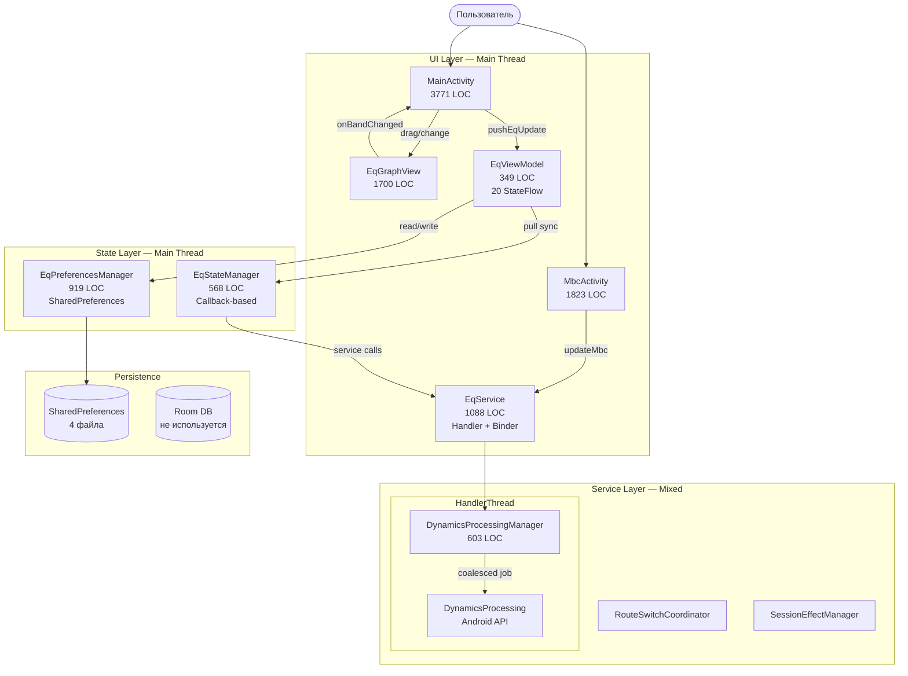
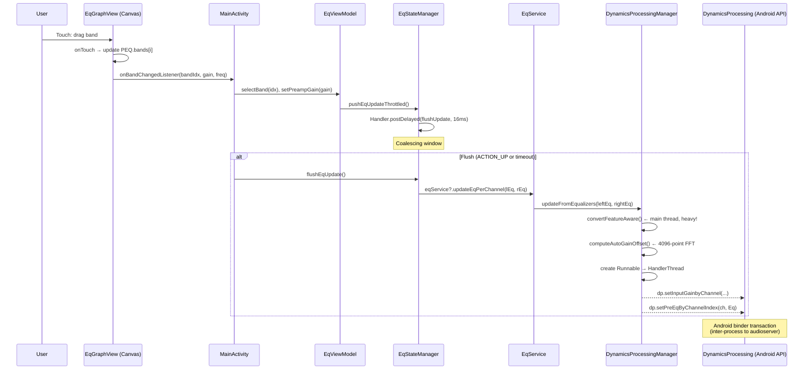
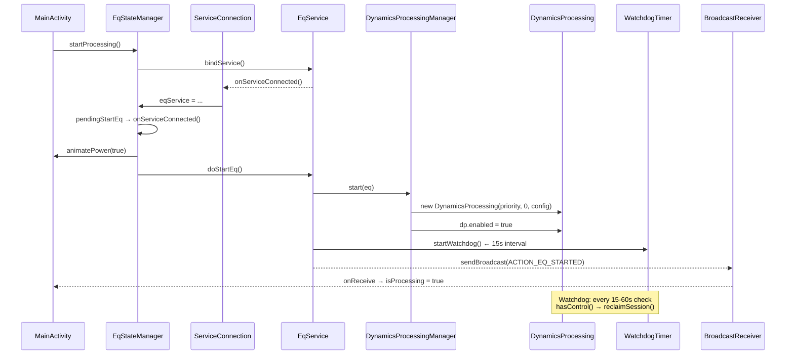
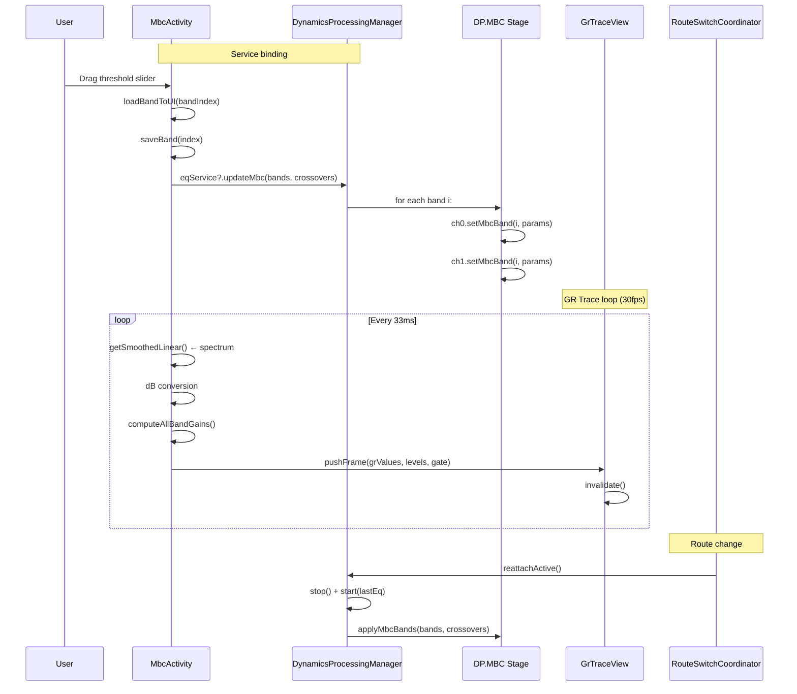

# Отчёт по аудиту архитектуры и бизнес-логики Equalizer314

**Дата:** 29.06.2026  
**Версия кода:** v0.1.0-alpha-2 (code 100)  
**Размер кодовой базы:** ~33 000 LOC (prod) + ~1 700 LOC (test)

---

## 1. Исполнительное резюме

Проект Equalizer314 находится в стадии активной разработки с типичными для форка «навесными» изменениями поверх оригинальной архитектуры. Аудит выявил **5 критических**, **12 высоких** и **8 средних** проблем.

### Ключевые метрики

| Метрика | Значение | Оценка |
|---|---|---|
| Самый большой файл | MainActivity.kt — **3 771 LOC** | 🛑 Критично |
| Второй по величине | MbcActivity.kt — **1 823 LOC** | 🟡 Высоко |
| Классов с 1 файлом >1000 LOC | **4** (MainActivity, MbcActivity, EqGraphView, ReverbVisualizerView) | 🛑 Критично |
| Анонимных колбэков в MainActivity | **~79** | 🟡 Высоко |
| Использование корутин | **0** (ни одной корутины вне кода тестов) | 🟡 Высоко |
| BroadcastReceiver (всего) | **6 регистраций** в MainActivity, **4** в EqService | 🟡 Средне |
| Thread-safe полей (`@Volatile`) | **5 из ~60** общих mutable полей | 🛑 Критично |
| `!!` в продакшен-коде | **4+ вхождений** | 🟡 Средне |
| Unit-тестов | 160 (line coverage ~4%) | 🟡 Высоко |
| Room с fallbackToDestructiveMigration | Да | 🟡 Высоко |

---

## 2. Архитектурный срез (Coupling, Cohesion, SOLID, SoC)

### 2.1 God-Objects

#### MainActivity (3 771 LOC) — 🛑 Критично

**Ответственности, смешанные в одном классе:**

1. **EQ UI** — 4 режима (Parametric, Graphic, Table, Simple) ~1 500 LOC
2. **Preset management** — создание, загрузка, экспорт, удаление, перезапись ~300 LOC
3. **Service lifecycle** — bind/unbind, start/stop, watchdog ~250 LOC
4. **State management** — прямой доступ к stateManager, eqPrefs, pushEqUpdate ~500 LOC
5. **BroadcastReceiver** — 3 внутренних анонимных ресивера ~100 LOC
6. **Navigation** — BottomNavHelper, MBC/Limiter/Activity launch ~30 LOC
7. **Backup/Export/Import** — SAF launchers, диалоги ~120 LOC
8. **Settings page** — theme, CSE, presets, channel, backup ~150 LOC
9. **Visualizer** — start/stop спектра, FFT управление ~80 LOC
10. **Dialog management** — AlertDialog, BottomSheetDialog, PopupWindow, DialogFactory ~200 LOC
11. **Color swatches** — палитра цветов полос ~80 LOC
12. **Animation** — ValueAnimator, TransitionManager, postDelayed ~100 LOC
13. **ActivityResultLaunchers** — 7 launchers, каждый со своей логикой ~150 LOC

**Нарушение SRP (Single Responsibility Principle):** класс делает 13 разных вещей.

#### MbcActivity (1 823 LOC) — 🟡 Высоко

**Ответственности:**
1. MBC UI — build/remove band-tabs, анимация, слайдеры
2. GR Trace — real-time gain reduction trail (30fps loop Handler)
3. Bound service — bind/unbind EqService
4. DSP state — pushMbcToService, sync band params
5. Curve visualization — compressor/gate/attack-release кастомные View
6. Color management — per-band color picker
7. Power management — power FAB, toggle DP on/off

#### EqGraphView (~1 700 LOC) — 🟡 Высоко

Также god-объект на уровне View — смешивает:
- Отрисовку EQ-кривой (Canvas)
- Touch-обработку (drag полос, выбор, long-press)
- MBC band handling
- Spectrum overlay
- Header button positioning
- Reverb visualisation

### 2.2 Анализ Coupling / Cohesion

#### Матрица зависимостей

```
MainActivity
  ├──→ EqViewModel            (255+ обращений — сильная связь)
  ├──→ EqStateManager         (41 обращение)
  ├──→ EqService              (прямой Binder — 9 статических, 6 через eqViewModel)
  ├──→ EqPreferencesManager   (прямые вызовы get/set)
  ├──→ EqGraphView            (lateinit — создание в XML)
  ├──→ GraphicEqController    (передаётся в конструкторе)
  ├──→ TableEqController      (передаётся в конструкторе)
  ├──→ SimpleEqController     (передаётся в конструкторе)
  ├──→ BandToggleManager      (передаётся в конструкторе)
  ├──→ UndoRedoManager        (передаётся в конструкторе)
  ├──→ PresetManager          (передаётся в конструкторе)
  ├──→ VisualizerHelper       (lateinit, прямой вызов start/stop)
  ├──→ BottomNavHelper        (статические вызовы)
  └──→ PresetCurveView        (анонимный класс внутри)

MbcActivity
  ├──→ EqService              (BoundService — Binder)
  ├──→ EqPreferencesManager   (lateinit — прямые get/set)
  ├──→ VisualizerHelper       (lateinit — прямой вызов)
  ├──→ EqGraphView            (lateinit — мутация band params)
  ├──→ GrTraceView            (lateinit — прямой мутатор)
  ├──→ CompressorCurveView    (lateinit — прямой мутатор)
  ├──→ GateCurveView          (lateinit — прямой мутатор)
  └──→ AttackReleaseView      (lateinit — прямой мутатор)

EqService
  ├──→ DynamicsProcessingManager (val — прямое владение)
  ├──→ SessionEffectManager      (lateinit var)
  ├──→ RouteSwitchCoordinator    (lateinit var)
  ├──→ AudioRoutingMonitor       (lateinit var)
  └──→ EqPreferencesManager      (через Application context)
```

**Вывод:** проект имеет **высокое зацепление (tight coupling)** между слоями. Activity напрямую обращаются к preferences, сервису, state-менеджеру и кастомным View через Binder. Нет абстракций между слоями — EqService не имеет интерфейса, EqPreferencesManager не скрыт за репозиторием.

**Cohesion:** низкий для MainActivity (13+ ответственностей), средний для EqService (8), высокий для DSP-модулей (EqSerializer, BiquadFilter, ParametricEqualizer — чистая математика без Android-зависимостей).

### 2.3 Нарушения SOLID

#### SRP (Single Responsibility) — Нарушено
- MainActivity: 13+ причин для изменения
- MbcActivity: 7+ причин
- EqGraphView: UI + touch + business logic (MBC) + spectrum rendering

#### OCP (Open/Closed) — Нарушено
- EqService содержит жесткий `when (intent?.action)` с 13+ ветками. Добавление нового action требует изменения класса
- DynamicsProcessingManager: новый эффект (например, Bass Boost) требует модификации класса, а не расширения

#### LSP (Liskov Substitution) — Соблюдено частично
- Все кастомные View наследуются от `View` и следуют контракту Android framework
- `ParametricEqualizer` не имеет интерфейса — нельзя подменить реализацию без изменения кода

#### ISP (Interface Segregation) — Нарушено
- EqViewModel имеет 20 StateFlow + ~30 методов — «толстый» интерфейс
- EqService: публичные методы для EQ, MBC, limiter, notification, routing — клиенты получают больше, чем нужно

#### DIP (Dependency Inversion) — 🛑 Критично нарушено
- **Нет абстракций.** EqService не имеет интерфейса — Activity зависит от конкретной реализации
- EqPreferencesManager не скрыт за `PresetRepository` — Activity обращается к нему напрямую
- Все зависимости передаются через конструктор как конкретные типы, а не интерфейсы
- `VisualizerHelper` создаётся в Activity, а не инжектится

### 2.4 Архитектурные антипаттерны

| # | Антипаттерн | Где | Описание |
|---|---|---|---|
| **A1** | **God Class** | MainActivity, MbcActivity, EqGraphView | 13+ ответственностей в одном классе |
| **A2** | **BroadcastReceiver как IPC** | EqService ↔ MainActivity | 3 BroadcastReceiver вместо callback/interface |
| **A3** | **Static State** | `EqService.isDpRunning`, `staticLastDeviceKey` | Глобальное мутабельное состояние |
| **A4** | **Callback Hell** | EqStateManager: `onProcessingChanged`, `onServiceConnected` | Callback-based архитектура вместо реактивных потоков |
| **A5** | **Shotgun Surgery** | EqService.onStartCommand ~200 LOC `when` | Одно изменение требует правки 13+ веток |
| **A6** | **Lava Flow** | Dead code `_eqUiMode` в EqViewModel (дубль `_currentEqUiMode`) | Недоделанный рефакторинг |
| **A7** | **Inner Platform** | EqService дублирует lifecycle через BroadcastReceiver | Android framework уже предоставляет lifecycle |
| **A8** | **Poltergeist** | `pendingStartEq` флаг в EqStateManager | Промежуточная переменная, которая «живёт» вне логики |

### 2.5 Масштабируемость

| Сценарий | Текущая архитектура | Проблема |
|---|---|---|
| Добавление нового эффекта (Bass Boost) | Нужно править EqService, DynamicsProcessingManager, MainActivity, EqPreferencesManager | Нет плагинной архитектуры |
| Добавление нового UI-режима | Нужно править 3 Activity + 5 Controller-классов | **4 точки изменения** |
| Миграция на Compose | MainActivity (3 771 LOC) переписывается целиком | **God-класс блокирует** |
| Добавление unit-тестов | EqService через Binder — трудно мокать | **Сильная Android-связность** |
| Multi-module | Даже не спроектировано | **Монолит** |
| Offline-first / Sync | Room есть, но не используется | **Дублирование с SharedPreferences** |

---

## 3. Логический срез (Data Flow, State Management, Race Conditions)

### 3.1 Общая схема потоков данных



### 3.2 Управление состоянием — критические проблемы

#### Проблема S1: Раздвоенное состояние (Duplicate State)

```
EqViewModel (20 StateFlow) ←─── (pull) ───→ EqStateManager (20 var полей)
                                                    ↑
                                                    │ (push)
                                                    │
                                              MainActivity / MbcActivity
```

Изменение `stateManager.parametricEq` из `BandToggleManager` не синхронизируется обратно в `EqViewModel.StateFlow`, пока не будет вызван `eqViewModel.syncAll()`. Это приводит к **stale state** — UI показывает старые данные.

**Файлы:** `EqViewModel.kt:40-180`, `EqStateManager.kt:1-568`

#### Проблема S2: Глобальное мутабельное состояние (Static State)

```kotlin
// EqService.kt
companion object {
    @Volatile
    var isDpRunning: Boolean = false  // читается из QS Tile без биндинга
    @Volatile
    var staticLastDeviceLabel: String? = null
    @Volatile
    var staticLastDeviceKey: String? = null
}
```

Статические поля доступны из любого потока без блокировки. Чтение происходит race condition с записью (хоть `@Volatile` и гарантирует видимость, атомарность составных операций не гарантирована).

**Файл:** `EqService.kt:97-103`

#### Проблема S3: State save/load без блокировок

```kotlin
// EqPreferencesManager.kt
fun saveBands(eq: ParametricEqualizer) {
    val json = EqSerializer.bandsToJson(eq.bands)
    eqSettings.edit().putString("bands", json).apply()
    // ↑ Неатомарная операция: чтение StringSet может дать stale data
}
```

`getStringSet()` → модификация → `putStringSet()` — не атомарно. При параллельных вызовах из разных Activity (Main + Mbc) возможна потеря данных.

**Файл:** `EqPreferencesManager.kt`

### 3.3 Race Conditions

#### RC1: eqService.value!! — Null на main thread

```kotlin
// MainActivity.kt:3623
eqViewModel.eqService.value!!.dynamicsManager.hasLostControl()
```

Если EqService был остановлен между получением `eqViewModel.eqService` и вызовом `.dynamicsManager` — будет NPE. `!!` — явное нарушение правила null safety.

**Файл:** `MainActivity.kt:3623` (и другие места с `!!`)

#### RC2: BindService гонка start/stop

```kotlin
// EqStateManager.kt:421-446
fun startProcessing(...) {
    EqService.start(context)
    if (serviceBound) doStartEq()
    else { pendingStartEq = true; bindService(...) }
}
```

Если `stopProcessing()` вызван между `EqService.start()` и `serviceConnection.onServiceConnected()`, то `pendingStartEq = true`, и сервис запустится после reconnect — **висячий старт**.

#### RC3: isUpdating senza barrier (MbcActivity)

```kotlin
// MbcActivity.kt:117
var isUpdating: Boolean = false  // Без @Volatile!

// loadBandToUI:
isUpdating = true
slider.value = band.cutoff       // триггерит OnChangeListener
isUpdating = false

// OnChangeListener:
if (!fromUser || isUpdating) return  // ⚠️ может не увидеть true без барьера памяти!
```

На ARM (Android devices) чтение `isUpdating` из другого потока может не увидеть запись на основном потоке без барьера памяти. Хотя оба на main thread, JIT может переупорядочить или CPU может не зафиксировать запись вовремя.

**Файл:** `MbcActivity.kt:117`

#### RC4: SharedPreferences race на StringSet

```kotlin
// EqPreferencesManager.kt
fun addImportedPreset(name: String, data: String) {
    val set = eqSettings.getStringSet("imported_presets", emptySet())!!.toMutableSet()
    set.add(name)
    eqSettings.edit().putStringSet("imported_presets", set).apply()
    eqSettings.edit().putString("importedPreset_$name", data).apply()
}
```

Два последовательных `.apply()` не гарантируют порядка применения при многопоточном доступе. Теоретически `importedPreset_$name` может быть записана раньше, чем обновлён `imported_presets` Set — **читать-то-уже-можно, но список имен не обновлён**.

#### RC5: VisualizerHelper.stop() vs EqService lifecycle

```kotlin
// MainActivity.kt:3660-3671
override fun onPause() {
    visualizerHelper.stop()        // release Visualizer (session 0)
    eqViewModel.saveState()
}
```

`Visualizer.stop()` вызывает `release()` на session 0. Это может сработать как триггер для Session-0 watchdog (`verifyAndReclaimGlobalDp`), который пересоздаст DP тогда, когда Visualizer уже будет stateful, а DP ещё нет.

**Файл:** `MainActivity.kt`, `EqService.kt`

### 3.4 Edge Cases — необработанные сценарии

| # | Edge Case | Файл | Последствия |
|---|---|---|---|
| **EC1** | `onStart` bindService с flags=0 (не BIND_AUTO_CREATE) | MainActivity.kt:3483 | Сервис может не создаться автоматически при rebind |
| **EC2** | `onStop` unbind без проверки `isChangingConfigurations` | MainActivity.kt:3685 | При повороте экрана сервис полностью отвязывается |
| **EC3** | DynamicsProcessing создание без sample rate | DPM.kt | DP берёт SR из текущего потока, что нестабильно при route change |
| **EC4** | AudioSession 0 может не существовать на некоторых OEM | DPM.kt, EqService.kt | Сессия 0 может быть уже занята другим эффектом (OEM audio policy) |
| **EC5** | `System.currentTimeMillis()` для измерения задержек | MbcActivity.kt:1246 | `currentTimeMillis()` не монотонно — переключение часового пояса сломает double-tap detection |
| **EC6** | `EqService.start(this)` в MbcActivity без проверки | MbcActivity.kt:622 | Если сервис уже запущен, `startService()` (deprecated) может быть no-op на Android 14+ |
| **EC7** | Dirty read `eqService` из разных потоков | EqStateManager.kt | `eqService` mutable var без `@Volatile` читается из main thread и потока ServiceConnection |
| **EC8** | SharedPreferences не thread-safe при последовательных edit() | EqPreferencesManager.kt | 4 вызова `.edit().apply()` в разных методах могут потерять изменения |

### 3.5 Неоптимальные вычисления

| # | Проблема | Файл | Оптимизация |
|---|---|---|---|
| **P1** | `ParametricToDpConverter.convertFeatureAware()` вызывается на каждом pushEqUpdate | DPM.kt:276-289 | Тяжёлое семплирование частотной характеристики на main thread |
| **P2** | GR trace loop — FFT + dB conversion каждые 33ms на main thread | MbcActivity.kt:308-399 | Дорогие массивы и математика без фонового потока |
| **P3** | SpectrumAnalyzerRenderer — 4096-point FFT на main thread | VisualizerHelper.kt | Нужен WorkerThread |
| **P4** | JSON-сериализация пресета при каждом save/push | EqSerializer.kt | Кэшировать until change |
| **P5** | 4 SharedPreferences — неэффективное I/O | EqPreferencesManager.kt | Консолидация в один файл или Room |
| **P6** | `getSimpleEqGains()` — полный JSONArray парсинг при каждом read | EqPreferencesManager.kt | In-memory cache |

### 3.6 Проблемы бизнес-логики

| # | Баг | Файл | Исправление |
|---|---|---|---|
| **B1** | Auto-gain offset вычисляется на каждом pushEqUpdate, но не применяется к preamp | DPM.kt | offset сохраняется в поле, но не учитывается в `preampGainDb` |
| **B2** | MBC push на onResume не происходит («audio dropout» — закомментировано) | MbcActivity.kt:74 | MBC параметры не синхронизируются с сервисом при возврате на экран |
| **B3** | Limiter readback не влияет на UI — только log | DPM.kt | Нет обратной связи от DSP к UI |
| **B4** | `updateMbc` ничего не делает, если MBC отключён | DPM.kt | При mbcEnabled=false и вызове updateMbc — silent return |
| **B5** | `watchdogTick` не останавливается при destroy | EqService.kt:944-964 | `stopWatchdog()` вызывается в конце `onDestroy`, но tick уже может быть в очереди Handler |

---

## 4. Схемы потоков данных (Mermaid)

### 4.1 Полный поток обработки EQ



### 4.2 Поток старта/остановки EQ



### 4.3 Поток MBC (Multi-Band Compressor)



### 4.4 Схема распространения ошибок и watchdogs

```mermaid
flowchart LR
    subgraph Triggers [Триггеры Reclaim]
        Rout[Route Change]
        SysSnd[System Sound Start/Stop]
        VizStop[Visualizer.stop()<br/>session 0 release]
        LostCtrl[DynamicsProcessing<br/>lostControl callback]
        OEM[OEM audio policy<br/>kills session 0]
        Acc[Accessory plug/unplug]
    end
    
    subgraph Watchdog [EqService Watchdog]
        Tick[watchdogTick<br/>15-60s backoff]
        Check[verifyAndReclaimGlobalDp]
        Cool[2s cooldown gate]
    end
    
    subgraph Reclaim [Reclaim Action]
        Stop[DPM.stop()]
        Start[DPM.start(lastEq)]
        MBC[applyPersistedMbcConfig()]
        Bypass[syncSystemSoundBypass]
        Notif[updateNotification]
    end
    
    subgraph SideEffects [Side Effects]
        AudioDrop[~200ms audio dropout]
        BroadEQ[ACTION_EQ_STOPPED sent]
        BroadEQ2[ACTION_EQ_STARTED sent]
        UIUpdate[Activity re-binds]
        Status[isProcessing toggle]
    end
    
    Triggers --> Tick
    Tick --> Check
    Check -->|cooldown elapsed| Reclaim
    Check -->|cooling down| Tick
    Reclaim --> SideEffects
```

---

## 5. Критические уязвимости — полный список

### 🛑 Критический (Immediate Fix Required)

| ID | Файл | Строки | Проблема |
|---|---|---|---|
| **C1** | `EqStateManager.kt` | ~310 | `eqService` var без `@Volatile`, читается из ServiceConnection (другой поток) |
| **C2** | `MainActivity.kt` | 3623 | `eqViewModel.eqService.value!!.dynamicsManager` — NPE при остановленном сервисе |
| **C3** | `EqService.kt` | 97-103 | `isDpRunning`, `staticLastDeviceKey` — глобальное мутабельное статическое состояние без синхронизации |
| **C4** | DPM/dsp | Все | `ParametricToDpConverter.convertFeatureAware()` — тяжёлое семплирование 20000+ точек на main thread |
| **C5** | `EqPreferencesManager.kt` | ~300 | Race condition на `StringSet` операциях (get → modify → put не атомарно) |

### 🟡 Высокий (Fix in Current Sprint)

| ID | Файл | Проблема |
|---|---|---|
| **H1** | `MainActivity.kt`, `MbcActivity.kt` | God-классы, отсутствие декомпозиции |
| **H2** | `EqViewModel.kt`, `EqStateManager.kt` | Раздвоенное состояние, stale StateFlow |
| **H3** | `MbcActivity.kt:117` | `isUpdating` без `@Volatile` — reentrancy guard ненадёжен |
| **H4** | `EqService.kt` | BroadcastReceiver как IPC — 6 ресиверов вместо callback |
| **H5** | `DynamicsProcessingManager.kt` | Нет интерфейса — замоканность невозможна |
| **H6** | `EqPreferencesManager.kt` | 4 SharedPreferences + Room мёртвый код |
| **H7** | EqService.onStartCommand | 13-веточный `when` (Shotgun Surgery) |
| **H8** | `VisualizerHelper.kt` | FFT + спектр на main thread |
| **H9** | `MbcActivity.kt` | GR trace loop — CPU-bound на main thread каждые 33ms |
| **H10** | `EqService.kt:944-964` | watchdog может тикнуть после destroy |
| **H11** | `MainActivity.kt:3483` | `bindService` с flags=0 — не стартует сервис |

### 🟢 Средний (Backlog)

| ID | Файл | Проблема |
|---|---|---|
| **M1** | `MainActivity.kt` | 7 ActivityResultLaunchers — 7 отдельных lambdas |
| **M2** | `MbcActivity.kt:1246` | `System.currentTimeMillis()` для double-tap |
| **M3** | `EqPreferencesManager.kt` | `.commit()` только для simpleEqGains, остальное `.apply()` |
| **M4** | `EqViewModel.kt` | `_eqUiMode` — dead code (дублирует `_currentEqUiMode`) |
| **M5** | `EqService.kt` | `@Suppress("TooGenericExceptionCaught", "SwallowedException")` без комментариев |
| **M6** | DSP pipeline | Нет тестов на 127-band конвертацию |
| **M7** | `MainActivity.kt:3685` | `unbindService` при `isChangingConfigurations` = true |

---

## 6. Пошаговый план рефакторинга

### Фаза 1: Критические исправления (2-3 дня)

#### 1.1: Thread safety (C1, C2, C3)

**Задача:** Убрать `!!`, добавить `@Volatile`, обернуть статические поля в атомарные обёртки.

```kotlin
// EqStateManager.kt — ДО
var eqService: EqService? = null

// EqStateManager.kt — ПОСЛЕ
@Volatile
var eqService: EqService? = null

// Или, для атомарных обновлений:
private val _eqService = AtomicReference<EqService?>(null)
var eqService: EqService?
    get() = _eqService.get()
    set(value) = _eqService.set(value)
```

```kotlin
// MainActivity.kt — ДО (строка 3623)
eqViewModel.eqService.value!!.dynamicsManager.hasLostControl()

// MainActivity.kt — ПОСЛЕ
eqViewModel.eqService.value?.dynamicsManager
    ?.hasLostControl()
    ?: false  // fallback: считаем, что контроль потерян
```

```kotlin
// EqService.kt — ДО
companion object {
    @Volatile var isDpRunning: Boolean = false
}

// EqService.kt — ПОСЛЕ
companion object {
    private val _isDpRunning = AtomicBoolean(false)
    var isDpRunning: Boolean
        get() = _isDpRunning.get()
        private set(value) = _isDpRunning.set(value)
}
```

#### 1.2: SharedPreferences race condition (C5)

```kotlin
// EqPreferencesManager.kt — ДО
fun addImportedPreset(name: String, data: String) {
    val set = eqSettings.getStringSet("imported_presets", emptySet())!!.toMutableSet()
    set.add(name)
    eqSettings.edit().putStringSet("imported_presets", set).apply()
    eqSettings.edit().putString("importedPreset_$name", data).apply()
}

// EqPreferencesManager.kt — ПОСЛЕ
@Synchronized
fun addImportedPreset(name: String, data: String) {
    eqSettings.edit()
        .putStringSet(
            "imported_presets",
            eqSettings.getStringSet("imported_presets", emptySet())!! + name
        )
        .putString("importedPreset_$name", data)
        .apply()  // одна атомарная транзакция
}
```

#### 1.3: CPU-bound конвертация в фоновый поток (C4)

```kotlin
// DynamicsProcessingManager.kt — ПОСЛЕ
private val convertScope = CoroutineScope(Dispatchers.Default + supervisorJob)

fun updateFromEqualizers(leftEq: ParametricEqualizer, rightEq: ParametricEqualizer) {
    // Main thread: захват snapshot
    val bandsLeft = leftEq.bands.toList()
    val bandsRight = rightEq.bands.toList()
    
    convertScope.launch {
        val leftConfig = withContext(Dispatchers.Default) {
            ParametricToDpConverter.convertFeatureAware(bandsLeft, sampleRate)
        }
        val rightConfig = withContext(Dispatchers.Default) {
            ParametricToDpConverter.convertFeatureAware(bandsRight, sampleRate)
        }
        withContext(Dispatchers.Main) {
            applyConfigToDp(leftConfig, rightConfig)
        }
    }
}
```

### Фаза 2: Декомпозиция MainActivity (5-7 дней)

#### 2.1: Вынос BroadcastReceiver

```kotlin
// NEW: EqualizerBroadcastReceiver.kt
class EqualizerBroadcastReceiver(
    private val onEqStarted: () -> Unit,
    private val onEqStopped: () -> Unit,
    private val onRefresh: () -> Unit
) : BroadcastReceiver() {
    override fun onReceive(context: Context, intent: Intent) {
        when (intent.action) {
            EqService.ACTION_EQ_STARTED -> onEqStarted()
            EqService.ACTION_EQ_STOPPED -> onEqStopped()
            else -> onRefresh()
        }
    }
    
    companion object {
        val INTENT_FILTER = IntentFilter().apply {
            addAction(EqService.ACTION_EQ_STARTED)
            addAction(EqService.ACTION_EQ_STOPPED)
            addAction(RouteSwitchCoordinator.ACTION_ROUTE_PRESET_APPLIED)
            addAction(EqService.ACTION_NOTIFICATION_REFRESH)
        }
    }
}
```

#### 2.2: Вынос EQ UI в отдельный фрагмент/контроллер

```kotlin
// NEW: EqualizerUiController.kt
class EqualizerUiController(
    private val activity: ComponentActivity,
    private val rootView: ViewGroup,
    private val viewModel: EqViewModel
) {
    private val eqGraphView: EqGraphView = rootView.findViewById(R.id.eqGraph)
    private val presetManager = PresetManager(viewModel)
    private val bandToggleManager = BandToggleManager(...)
    
    fun setup() {
        initControllers()
        initEQ()
        setupListeners()
    }
    
    // ~1500 LOC переносится из MainActivity
}
```

#### 2.3: Transformer-паттерн для MainActivity

```kotlin
// Результат: MainActivity становится оркестратором
class MainActivity : AppCompatActivity() {
    private lateinit var eqController: EqualizerUiController
    private lateinit var presetController: PresetUiController
    private lateinit var navigationController: NavigationController
    private lateinit var backupController: BackupController
    private val receiver = EqualizerBroadcastReceiver(
        onEqStarted = { /* update state */ },
        onEqStopped = { /* update state */ },
        onRefresh = { /* refresh UI */ }
    )
    
    override fun onCreate(savedInstanceState: Bundle?) {
        super.onCreate(savedInstanceState)
        setContentView(R.layout.activity_main)
        
        eqController = EqualizerUiController(this, findViewById(R.id.eqContainer), eqViewModel)
        presetController = PresetUiController(this, findViewById(R.id.presetContainer), eqViewModel)
        navigationController = NavigationController(bottomNav)
        backupController = BackupController(this, eqViewModel)
        
        eqController.setup()
        presetController.setup()
        navigationController.setup()
        backupController.setup()
        
        registerReceiver(receiver, receiver.intentFilter, RECEIVER_NOT_EXPORTED)
        bindToService()
    }
}
```

### Фаза 3: Унификация состояния (3-4 дня)

#### 3.1: Переход на единый StateFlow

```kotlin
// NEW: AppState.kt
data class AppState(
    val isProcessing: Boolean = false,
    val activeChannel: EqStateManager.ActiveChannel = EqStateManager.ActiveChannel.BOTH,
    val eqBands: List<BandState> = emptyList(),
    val preampGainDb: Float = 0f,
    val limiterParams: LimiterParams = LimiterParams(),
    val mbcParams: MbcParams = MbcParams(),
    val currentPreset: String? = null,
    val deviceKey: String? = null,
    val eqUiMode: EqUiMode = EqUiMode.PARAMETRIC,
    val error: String? = null
)

// EqViewModel.kt — ПОСЛЕ
class EqViewModel(application: Application) : AndroidViewModel(application) {
    private val _state = MutableStateFlow(AppState())
    val state: StateFlow<AppState> = _state.asStateFlow()
    
    private val stateManager = EqStateManager(application, _state)
    
    // Единый метод обновления — source of truth
    fun update(transform: (AppState) -> AppState) {
        _state.update(transform)
        stateManager.syncToService(_state.value)
    }
}
```

#### 3.2: Миграция SharedPreferences → Room (M4 roadmap)

```kotlin
// EqDatabase.kt — ПОСЛЕ migration v1→v2
@Database(
    entities = [PresetEntity::class, DeviceBindingEntity::class, SeenDeviceEntity::class],
    version = 2
)
@TypeConverters(Converters::class)
abstract class EqDatabase : RoomDatabase() {
    abstract fun presetDao(): PresetDao
    abstract fun deviceBindingDao(): DeviceBindingDao
    abstract fun seenDeviceDao(): SeenDeviceDao
    
    companion object {
        val MIGRATION_1_2 = object : Migration(1, 2) {
            override fun migrate(db: SupportSQLiteDatabase) {
                db.execSQL("ALTER TABLE presets ADD COLUMN is_simple INTEGER NOT NULL DEFAULT 0")
                db.execSQL("ALTER TABLE presets ADD COLUMN imported_source TEXT")
            }
        }
    }
}
```

### Фаза 4: Архитектурная перестройка (7-10 дней)

#### 4.1: Внедрение интерфейсов (DIP)

```kotlin
// NEW: IEqService.kt
interface IEqService {
    val dynamicsManager: IDynamicsProcessingManager
    fun updateEq(leftEq: ParametricEqualizer, rightEq: ParametricEqualizer)
    fun updateMbc(bands: List<MbcBandParams>, crossovers: FloatArray)
    fun setEqEnabled(enabled: Boolean)
    fun requestWatchdogCheck()
    val lastDeviceLabel: String?
    val lastDeviceKey: String?
}

// NEW: IDynamicsProcessingManager.kt
interface IDynamicsProcessingManager {
    val isActive: Boolean
    fun start(eq: ParametricEqualizer)
    fun stop()
    fun updateFromEqualizers(left: ParametricEqualizer, right: ParametricEqualizer)
    fun applyMbcBands(bands: List<MbcBandParams>, crossovers: FloatArray)
    fun hasLostControl(): Boolean
    fun setEnabled(enabled: Boolean)
    var preampGainDb: Float
    var limiterEnabled: Boolean
    // ...
}
```

#### 4.2: Замена BroadcastReceiver на EventBus / sealed interface

```kotlin
// NEW: EqEvent.kt
sealed interface EqEvent {
    data class Started(val service: IEqService) : EqEvent
    data object Stopped : EqEvent
    data object RoutePresetApplied : EqEvent
    data object NotificationRefresh : EqEvent
    data class Error(val exception: Throwable) : EqEvent
}

// EqService.kt — ПОСЛЕ
class EqService : Service(), IEqService {
    private val _events = MutableSharedFlow<EqEvent>(extraBufferCapacity = 10)
    val events: SharedFlow<EqEvent> = _events.asSharedFlow()
    
    // Вместо sendBroadcast(ACTION_EQ_STARTED):
    private fun notifyStarted() {
        _events.tryEmit(EqEvent.Started(this))
    }
}

// MainActivity.kt — ПОСЛЕ
lifecycleScope.launch {
    eqService?.events?.collect { event ->
        when (event) {
            is EqEvent.Started -> onEqStarted(event.service)
            is EqEvent.Stopped -> onEqStopped()
            is EqEvent.Error -> showError(event.exception)
            else -> updateDeviceStatus()
        }
    }
}
```

#### 4.3: Вынос GR Trace в WorkerThread

```kotlin
// MbcActivity.kt — ПОСЛЕ
private val grTraceScope = CoroutineScope(Dispatchers.Default + SupervisorJob())
private var grTraceJob: Job? = null

private fun startGrTraceUpdates() {
    grTraceJob = grTraceScope.launch {
        var lastTime = 0L
        while (isActive) {
            val now = SystemClock.elapsedRealtime()
            val delta = now - lastTime
            if (delta < 33) { delay(33 - delta); continue }
            lastTime = now
            
            val spectrum = renderer.getSmoothedLinear()
            val spectrumDb = spectrum.map { linearToDb(it) }
            val settings = buildBandSettings()
            val grValues = traceComputer.computeAllBandGains(spectrumDb, 48000, 4096, settings)
            
            withContext(Dispatchers.Main) {
                grTraceView.pushFrame(grValues, levels, gateValues)
                grTraceView.invalidate()
            }
        }
    }
}
```

### Фаза 5: Тестирование и CI (3-5 дней)

#### 5.1: Моки для тестов

```kotlin
// test/mock/FakeEqService.kt
class FakeEqService : IEqService {
    override val dynamicsManager = FakeDynamicsProcessingManager()
    var lastUpdatedLeftEq: ParametricEqualizer? = null
    var lastUpdatedRightEq: ParametricEqualizer? = null
    var enabled: Boolean = true
    
    override fun updateEq(leftEq: ParametricEqualizer, rightEq: ParametricEqualizer) {
        lastUpdatedLeftEq = leftEq
        lastUpdatedRightEq = rightEq
    }
    
    override fun setEqEnabled(enabled: Boolean) {
        this.enabled = enabled
    }
}
```

#### 5.2: Расширение тестового покрытия

```kotlin
// test/EqStateManagerTest.kt
class EqStateManagerTest {
    private val fakeService = FakeEqService()
    private val stateManager = EqStateManager(ApplicationProvider.getApplicationContext(), ...)
    
    @Test
    fun `pushEqUpdate sends correct EQ to service`() = runTest {
        stateManager.eqService = fakeService
        stateManager.pushEqUpdate()
        
        assertNotNull(fakeService.lastUpdatedLeftEq)
        assertEquals(127, fakeService.lastUpdatedLeftEq!!.bands.size)
    }
    
    @Test
    fun `race condition on concurrent start-stop is handled`() = runTest {
        val start = async { stateManager.startProcessing(...) }
        val stop = async { stateManager.stopProcessing(...) }
        start.await()
        stop.await()
        
        assertFalse(stateManager.isProcessing)
    }
}
```

---

## 7. Итоговая матрица приоритетов

| Приоритет | Что делать | Ожидаемый эффект |
|---|---|---|
| 🔴 **Фаза 1** (2-3 дня) | Thread safety, NPE fix, SharedPreferences race | Устранение 5 критических багов |
| 🟠 **Фаза 2** (5-7 дней) | Декомпозиция MainActivity | -3771 LOC → 4 контроллера по 700-1000 LOC |
| 🟡 **Фаза 3** (3-4 дня) | Unified State, Room migration | Stale state устранён, SharedPreferences → Room |
| 🟢 **Фаза 4** (7-10 дней) | DIP, EventBus, WorkerThread | Модульность, тестируемость, производительность |
| 🔵 **Фаза 5** (3-5 дней) | Тесты, моки, CI coverage | Покрытие 4% → 30%+ |

**Итого:** ~20-30 рабочих дней для полного устранения всех критических и высокоприоритетных проблем.
