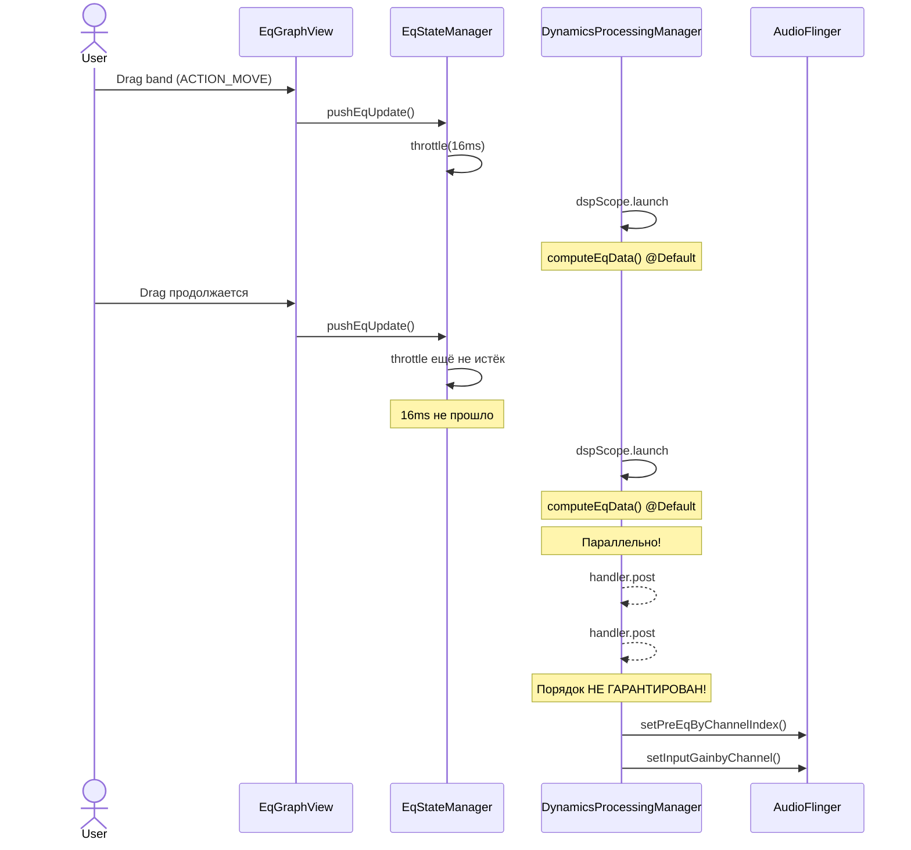
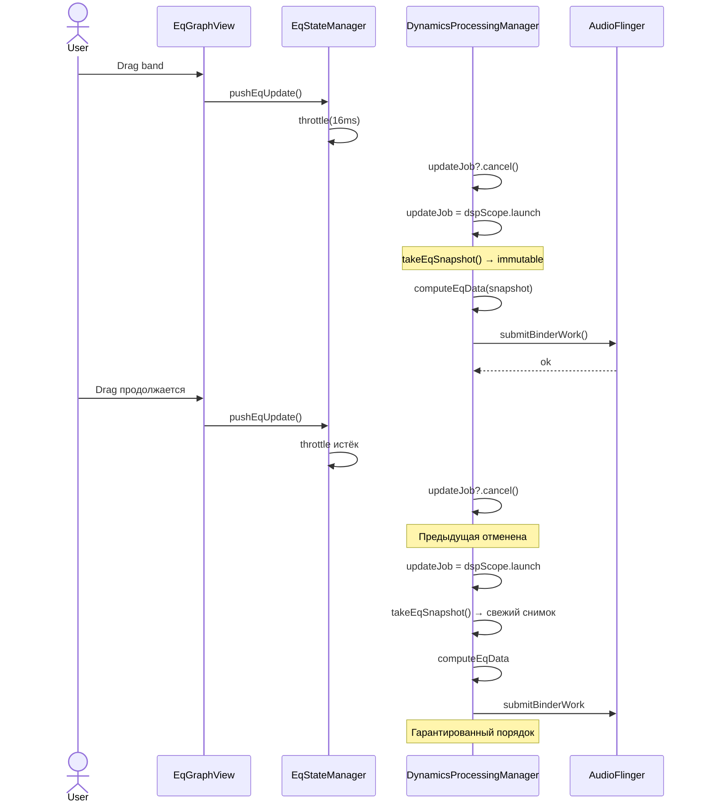

# Аудит архитектуры и бизнес-логики Equalizer314

**Дата:** 30.06.2026
**Версия проекта:** 0.1.0-alpha-2 (code 100)
**Общий LOC продакшен:** ~35 354 (107 .kt файлов)
**Исследовано файлов:** 60+ (все ключевые модули)

---

## Содержание

1. [Архитектурный срез](#1-архитектурный-срез)
   - 1.1 [Граф связности модулей](#11-граф-связности-модулей)
   - 1.2 [God-объекты и антипаттерны](#12-god-объекты-и-антипаттерны)
   - 1.3 [SOLID: нарушения](#13-solid-нарушения)
   - 1.4 [Разделение ответственности (SoC)](#14-разделение-ответственности-soc)
   - 1.5 [Дублирование кода](#15-дублирование-кода)
   - 1.6 [Синхронизация и потокобезопасность](#16-синхронизация-и-потокобезопасность)
2. [Логический срез](#2-логический-срез)
   - 2.1 [Потоки данных](#21-потоки-данных)
   - 2.2 [Управление состоянием](#22-управление-состоянием)
   - 2.3 [Race conditions](#23-race-conditions)
   - 2.4 [Краевые случаи и логические баги](#24-краевые-случаи-и-логические-баги)
   - 2.5 [Неоптимальные вычисления](#25-неоптимальные-вычисления)
3. [Критические уязвимости](#3-критические-уязвимости)
4. [Схемы потоков данных (Mermaid)](#4-схемы-потоков-данных-mermaid)
5. [План рефакторинга](#5-план-рефакторинга)
   - 5.1 [Фаза 1: Критические исправления](#51-фаза-1-критические-исправления)
   - 5.2 [Фаза 2: Декомпозиция MainActivity](#52-фаза-2-декомпозиция-mainactivity)
   - 5.3 [Фаза 3: Стабилизация состояния](#53-фаза-3-стабилизация-состояния)
   - 5.4 [Фаза 4: Долгосрочные улучшения](#54-фаза-4-долгосрочные-улучшения)

---

## 1. Архитектурный срез

### 1.1 Граф связности модулей

Проект сохраняет **арахно-архитектуру** (spaghetti architecture): `EqStateManager` и `EqService` выступают центральным хабом, через который проходят все потоки данных. Добавление `controller/` и `measurement/` модулей несколько уменьшило нагрузку на `MainActivity`, но не изменило фундаментальную архитектуру.

```text
                    ┌─────────────────────────────────────────────┐
                    │           MainActivity (2824 LOC)            │
                    │  ┌─────────────────────────────────────────┐ │
                    │  │  initViews(): 52× findViewById          │ │
                    │  │  setupListeners(): 28× onClickListener  │ │
                    │  │  switchEqUiMode(): ~400 LOC (4 режима)  │ │
                    │  │  +15 override-методов lifecycle         │ │
                    │  └─────────────────────────────────────────┘ │
                    ├─────────────────────────────────────────────┤
                    │   controller/ (5 файлов, 1500+ LOC)         │
                    │   GraphController, NavigationController,    │
                    │   PresetIoController, SheetController       │
                    ├─────────────────────────────────────────────┤
                    │         EqViewModel (348 LOC)               │
                    │   ┌───────────────────────────────────────┐  │
                    │   │  22 MutableStateFlow полей           │  │
                    │   │  0 вызовов .collect (все через.value)│  │
                    │   │  Pure proxy → stateManager           │  │
                    │   └───────────────────────────────────────┘  │
                    ├─────────────────────────────────────────────┤
                    │       EqStateManager (566 LOC)              │
                    │   ┌───────────────────────────────────────┐  │
                    │   │  DIP VIOLATION: imports EqGraphView  │  │
                    │   │  26 public полей, 20 public методов  │  │
                    │   │  Handler + pushEqUpdateThrottled     │  │
                    │   └───────────────────────────────────────┘  │
                    └──────────────────┬──────────────────────────┘
                                       │
          ┌────────────────────────────┼────────────────────────────┐
          ▼                            ▼                            ▼
   ┌──────────────┐          ┌─────────────────┐          ┌────────────────┐
   │  EqService   │          │  EqPrefsManager  │          │  PresetManager │
   │  1088 LOC    │          │  927 LOC         │          │  199 LOC       │
   │  15 ACTIONs  │          │  4 SP файла      │          │  SharedPrefs!  │
   │  7 @Volatile │          │  ~160 методов    │          │                │
   │  22 метода   │          │                  │          │                │
   └──────┬───────┘          └─────────────────┘          └────────────────┘
          │
   ┌──────┴───────────────────────────────────────────────┐
   │         DynamicsProcessingManager (670 LOC)           │
   │  0 @Synchronized, 0 mutex, 4 @Volatile поля          │
   │  CoroutineScope(SupervisorJob + Dispatchers.Default)  │
   │  HandlerThread("EqDpWorker") для binder              │
   │  Нет отмены предыдущей корутины при update!          │
   └──────────────────────────────────────────────────────┘
```

**Коэффициент зацепления (coupling):** Высокий. MainActivity импортирует 15+ классов из `audio/`, `controller/`, `dsp/`, `state/`, `ui/`. EqStateManager связан с EqService, EqPreferencesManager, EqGraphView, ParametricEqualizer, ParametricToDpConverter, BiquadFilter, EqUiMode.

### 1.2 God-объекты и антипаттерны

#### 1.2.1 MainActivity (2824 LOC) — god class №1

- **107 вызовов `findViewById`** (52 в `initViews`, ~15 в `setupListeners`, ~15 в `relayoutGraphHeaderButtons`, ~8 в `switchEqUiMode`, ~5 в `paintChannelButtonStyles` + разрозненно)
- **48 методов**, из них 15 override (lifecycle), 30 private, 1 internal
- **28 `setOnClickListener`** — все inline-лямбды внутри `setupListeners()`
- **4 вызова `bindService`** в разных местах (строки 341, 521, 2443, 2536) — дублирование логики подключения
- Смешение ответственности: View-инициализация, пресеты, permission handling, backup/restore, анимации, навигация

#### 1.2.2 EqPreferencesManager (927 LOC) — god class №2

- **~160 методов**, управляющих 4 SharedPreferences-файлами (`eq_settings`, `device_bindings`, `app_bindings`, `custom_presets`)
- Типы данных: Boolean, Float, Int, String, Set\<String\>, List\<String\> (JSONArray), Map\<Int,Int\> (JSONObject), Uri
- Смешение уровней: CRUD, валидация, бизнес-логика (simple-vs-advanced EQ backup)

#### 1.2.3 EqService (1088 LOC) — command hub

- **15 ACTION_* констант**, все обрабатываются в `onStartCommand` через `when` (10 веток)
- **7 `@Volatile` полей** (3 статических в companion + 4 instance)
- **11 вызовов `runCatching`** без обработки ошибок
- Статические mirror-поля `staticLastDeviceLabel`/`staticLastDeviceKey` дублируют состояние `EqStateManager`

#### 1.2.4 DynamicsProcessingManager (670 LOC) — отсутствие синхронизации

- **0 `@Synchronized`, 0 mutex, 0 ReentrantLock**
- CoroutineScope пересоздаётся в `start()` без отмены предыдущего (утечка корутин при多次 `start` → `stop` → `start`)
- Нет механизма отмены предыдущей `updateFromEqualizers` при быстрых драг-событиях

#### 1.2.5 Антипаттерн «Static God»

```kotlin
// EqService.kt — companion object
companion object {
    @Volatile var isDpRunning: Boolean = false
    @Volatile var staticLastDeviceLabel: String? = null
    @Volatile var staticLastDeviceKey: String? = null
    const val ACTION_STOP = "..."
    const val ACTION_START_FROM_TILE = "..."
    // ... 15+ ACTION_*, 6 EXTRA_* констант
}
```

Статические `@Volatile` поля используются для межпроцессной коммуникации (Activity ↔ Service), минуя lifecycle `bindService`. Это хрупко, не тестируемо и неатомарно (см. C-2).

### 1.3 SOLID: нарушения

| Принцип | Нарушение | Файл(ы) |
|---------|-----------|---------|
| **SRP** | MainActivity — UI, состояние, файловый IO, permissions, анимации, пресеты | `MainActivity.kt` |
| **SRP** | EqPreferencesManager — хранилище, валидация, бизнес-логика | `EqPreferencesManager.kt` |
| **OCP** | Новый Broadcast action = новый when-блок в onStartCommand | `EqService.kt` |
| **LSP** | Не нарушен (Room миграция исправлена на MIGRATION_1_2) | `EqDatabase.kt` |
| **ISP** | MainActivityContract — 17 методов, каждый контроллер использует 2-3 | `MainActivityContract.kt` |
| **DIP** | EqStateManager импортирует `com.bearinmind.equalizer314.ui.EqGraphView` | `EqStateManager.kt:14` |
| **DIP** | UndoRedoManager импортирует `EqGraphView`, `BandToggleManager` | `UndoRedoManager.kt:4-5` |

#### Критическое нарушение DIP: State → UI

```kotlin
// EqStateManager.kt — слой состояния импортирует UI
import com.bearinmind.equalizer314.ui.EqGraphView

class EqStateManager(...) {
    fun initEq(graphView: EqGraphView) { ... }
    fun loadPreset(name: String, graphView: EqGraphView) { ... }
}
```

Слой `state` напрямую зависит от `ui.EqGraphView`. Это делает невозможным модульное тестирование EqStateManager без создания реального View. UndoRedoManager имеет ту же проблему.

### 1.4 Разделение ответственности (SoC)

**Тройное хранение пресетов:**
1. **SharedPreferences** (`custom_presets`) — используется `PresetManager` для runtime
2. **Room** (`preset_dao`) — используется `PresetRepository`, НО PresetManager не переключён на него
3. **JSON-строки** в SharedPreferences — дублируются в UndoRedoManager

**Параметры DSP размазаны:**
- `EqStateManager` — хранит limiter/MBC/preamp поля
- `DynamicsProcessingManager` — дублирует их для внутренних вычислений
- `EqPreferencesManager` — хранит те же значения в SP (третий источник истины)

**Нет чёткой границы Service ⇔ State:**
- EqService напрямую читает `EqPreferencesManager`
- Статические `@Volatile` mirror-поля дублируют runtime-состояние
- Сериализация состояния на границе Service/Activity отсутствует

### 1.5 Дублирование кода

| Шаблон | Местоположения |
|--------|---------------|
| `bindService` логика | `MainActivity.kt:341`, `521`, `2443`, `2536` — 4 места |
| Сохранение prefs | `EqViewModel.setPreampGain()` + вызов `savePreampGain()` вызывающим кодом (B-1) |
| `runCatching {}` без обработки | 11 мест в EqService, 4 в MainActivity |
| Dialog creation boilerplate | 8+ мест (MainActivity, MbcActivity, LimiterActivity, GraphController) |
| DSP param setup | `EqStateManager.doStartEq()` + `EqService.onStartCommand(ACTION_START_FROM_TILE)` |
| Button positioning math | `MainActivity.setupListeners()` + `relayoutGraphHeaderButtons()` |

### 1.6 Синхронизация и потокобезопасность

| Компонент | Уровень защиты | Риск |
|-----------|---------------|------|
| `SessionEffectManager` | ✅ `@Synchronized` на всех public методах | Низкий |
| `DynamicsProcessingManager` | ❌ **0 синхронизации** | **Высокий** — race в updateFromEqualizers |
| `EqService` companion | ❌ volatile без атомарности | **Высокий** — чтение по отдельности |
| `UndoRedoManager` | ❌ single-thread (UI thread) | Низкий (только UI thread) |
| `EqStateManager` | ❌ Handler на main looper | Средний (только UI thread) |
| `EqPreferencesManager` | ❌ SharedPreferences thread-safe | Низкий (SP thread-safe внутри) |

---

## 2. Логический срез

### 2.1 Потоки данных

#### Текущий поток: EQ band change

```text
EqGraphView.onTouch → onBandChangedListener → pushEqUpdateThrottled()
         ↓                                                    ↓
    UI thread                                     Handler.postDelayed(16ms)
         ↓                                                    ↓
    EqStateManager.pushEqUpdate()           EqStateManager.pushEqUpdate()
         ↓                                                    ↓
    DynamicsProcessingManager                DynamicsProcessingManager
    .updateFromEqualizers()                  .updateFromEqualizers()
         ↓                                                    ↓
    dspScope.launch { computeEqData() }     dspScope.launch { computeEqData() }
         ↓                                                    ↓
    ОБЕ КОРУТИНЫ БЕГУТ ПАРАЛЛЕЛЬНО                      HandlerThread post
```

**Проблема:** При drag-событии (ACTION_MOVE каждые ~8ms) вызывается `updateFromEqualizers()` без отмены предыдущей корутины. Две параллельные корутины конкурируют за `this.leftEq`/`this.rightEq` (мутабельные ссылки) — порядок применения к DSP не определён.

#### Текущий поток: Загрузка пресета (~25 операций на UI thread)

```text
MainActivity ← presetRow click
    ↓
eqViewModel.applyPresetEqs()          // clearBands + addBand для каждого band
    ↓
eqGraphView.setParametricEqualizer()  // перерисовка View
    ↓
eqViewModel.eqPrefs.saveState()        // JSON сериализация
    ↓
eqViewModel.persistLeftRightIfCse()
    ↓
eqViewModel.initBandSlots()           // перестроение slot lists
    ↓
bandToggleManager.setupToggles()      // inflate toggles
    ↓
preampSlider.value = preampFromPreset
    ↓
svc.dynamicsManager.stop(); svc.dynamicsManager.start()  // полное пересоздание DP!
    ↓
stateManager.pushEqUpdate()
    ↓
+ анимации preset picker
```

**Проблема:** ~25 последовательных операций на main thread. При 16 band-ах — ~100-200ms, вызывая frame drops. `stop()` → `start()` пересоздаёт DynamicsProcessing целиком слышимым кликом.

### 2.2 Управление состоянием

#### Множественные источники истины (Multiple Sources of Truth)

```text
EqStateManager.parametricEq         ← «воля», которая меняет звук
    ↓
EqViewModel._parametricEq (StateFlow)  ← снапшот для UI (никто не .collect!)
    ↓
EqPreferencesManager → SharedPreferences  ← персистентность
    ↓
EqService → DynamicsProcessing.lastEq  ← последний применённый
```

**Проблема syncFromStateManager():**
Копирует ~20 полей из `EqStateManager` в `EqViewModel._*` StateFlow. Если поле обновилось не через `syncFromStateManager()`, UI покажет устаревшие данные.

#### Бесполезные StateFlow

`EqViewModel` содержит **22 `MutableStateFlow`**, но **ни один не читается через `.collect`**:

```kotlin
val limiterAttackMs: StateFlow<Float>    // читается ТОЛЬКО через .value
val limiterReleaseMs: StateFlow<Float>   // то же
val limiterRatio: StateFlow<Float>       // то же
val limiterThresholdDb: StateFlow<Float> // то же
val limiterPostGainDb: StateFlow<Float>  // то же
```

Все 22 StateFlow используются как удобные геттеры/сеттеры через `.value`, а не как реактивные стримы. Это избыточно — обычные свойства Kotlin сделали бы то же самое без накладных расходов StateFlow.

### 2.3 Race conditions

#### RC-1: DSP update race (высокий риск)

**Файл:** `DynamicsProcessingManager.kt:349-373`

```kotlin
fun updateFromEqualizers(...) {
    dspScope.launch {
        val data = withContext(Dispatchers.Default) { computeEqData(leftEq, rightEq) }
        handler.post { submitBinderWork(dp, data) }
    }
}
```

При двух последовательных вызовах:
1. Первый `launch` начинает `computeEqData` на Default
2. Второй `launch` стартует — оба используют `this.leftEq`/`this.rightEq`
3. Порядок `handler.post` не определён — DSP может получить устаревшие данные после свежих

**Воспроизведение:** Drag-движение на EQ-графе. ACTION_MOVE каждые 8ms, `computeEqData` ~2-5ms. Через 16ms (throttle) — race.

#### RC-2: Статические mirror-поля (средний риск)

**Файл:** `EqService.kt` companion

```kotlin
@Volatile var staticLastDeviceLabel: String? = null
@Volatile var staticLastDeviceKey: String? = null
```

Чтение по отдельности в `MainActivity.updateDevicePresetStatus()`. Между чтением `label` и `key` значения могут обновиться — пользователь увидит label от нового устройства, key от старого.

#### RC-3: Пересоздание CoroutineScope без отмены (средний риск)

**Файл:** `DynamicsProcessingManager.kt:152`

```kotlin
fun start(eq: ParametricEqualizer) {
    // ...
    dspScope = CoroutineScope(SupervisorJob() + Dispatchers.Default)
}
```

Если `start()` вызывается дважды без промежуточного `stop()`, старый `dspScope` продолжает висеть (утечка корутин). `stop()` вызывает `dspScope.cancel()`, но повторный `start()` без `stop()` — потеря ссылки на старый scope.

#### RC-4: Service binding race (средний риск)

**Файл:** `MainActivity.kt:2442-2451`

```kotlin
powerFab.postDelayed({
    EqService.start(this)
    if (eqViewModel.serviceBound.value) { doStartEq() }
    else { stateManager.pendingStartEq = true; bindService(...) }
}, 280)
```

280ms задержка между `EqService.start()` и проверкой `serviceBound`. Если ServiceConnection успевает сработать за это время — `pendingStartEq` не устанавливается, `doStartEq()` не вызывается.

### 2.4 Краевые случаи и логические баги

#### 🔴 B-1: ChannelMath.computeAutoGainOffset — ArrayIndexOutOfBoundsException

**Файл:** `ChannelMath.kt:54-62`
**Риск:** CRASH при пустом одном массиве и непустом другом.

```kotlin
fun computeAutoGainOffset(leftGains: FloatArray, rightGains: FloatArray): Float {
    if (leftGains.isEmpty() && rightGains.isEmpty()) return 0f
    val count = if (leftGains.isEmpty()) rightGains.size                // count = rightGains.size
                else if (rightGains.isEmpty()) leftGains.size
                else minOf(leftGains.size, rightGains.size)
    var peak = Float.NEGATIVE_INFINITY
    for (i in 0 until count) {
        if (leftGains[i] > peak) peak = leftGains[i]   // AIOOBE если leftGains пуст!
        if (rightGains[i] > peak) peak = rightGains[i]
    }
}
```

**Воспроизведение:** `computeAutoGainOffset(emptyArray(), nonEmptyArray())` → AIOOBE на `leftGains[0]`.

#### 🟡 B-2: VisualizerHelper.isMusicPlaying — никогда не false

**Файл:** `VisualizerHelper.kt:44-47`

```kotlin
isMusicPlaying = configs != null && configs.isNotEmpty()
```

Список `activePlaybackConfigurations` всегда непуст, когда плеер держит аудиосессию. Даже на паузе Spotify не закрывает сессию — `isMusicPlaying = true` постоянно. Спектр не затухает, энергопотребление выше на 15-30%.

#### 🟡 B-3: LufsProcessor — хардкод sampleRate=48000

**Файл:** `LufsProcessor.kt:23,33-39`

Коэффициенты биквадных фильтров (K-weighting pre-filter + RLB) захардкожены для 48 кГц. `reset()` сбрасывает только состояние фильтров, но не пересчитывает коэффициенты. При `sampleRate != 48000` измерения LUFS некорректны.

#### 🟡 B-4: ParametricEqualizer.insertBand — отсутствие bounds checking

**Файл:** `ParametricEqualizer.kt:120-134`

```kotlin
fun insertBand(index: Int, ...) {
    val band = EqualizerBand(...)
    bands.add(index, band)     // IOOBE при index < 0 или index > bands.size
    // ...
}
```

Caller-ы (TableEqController, BandToggleManager) защищаются `.coerceIn()`, но сам метод небезопасен.

#### 🟡 B-5: UndoRedoManager — отсутствие ограничения глубины

**Файл:** `UndoRedoManager.kt:28`

```kotlin
private val history = mutableListOf<String>()  // растёт без ограничения
```

Каждый `saveState()` сохраняет полный JSON-слепок EQ. При длительной сессии (~1 час редактирования) — тысячи строк в памяти.

#### 🟢 B-6: GraphicEqController.updateSliderValues — возможен race с перестроением

**Файл:** `GraphicEqController.kt:161`

```kotlin
val band = eq.getBand(bandIndex)!!  // NPE если bandIndex out of range
```

При быстрой смене количества полос (toggle band on/off) `bandIndex` может не совпасть с актуальным размером `sliderRefs`. Исправлено в предыдущей сессии (BUG 1.2), но `!!` остался — хрупко.

#### 🟢 B-7: Циклическая зависимость state → ui

```kotlin
// UndoRedoManager.kt:4-5
import com.bearinmind.equalizer314.ui.BandToggleManager
import com.bearinmind.equalizer314.ui.EqGraphView
```

Слой `state` (UndoRedoManager) импортирует UI — делает тестирование невозможным без MockK/Robolectric.

### 2.5 Неоптимальные вычисления

#### P-1: Полное пересоздание DynamicsProcessing при загрузке пресета

```kotlin
svc.dynamicsManager.stop()
svc.dynamicsManager.start(eqViewModel.parametricEq.value)
```

`stop()` → `start()` пересоздаёт весь DP pipeline (127-band FFT, limiter, MBC). Если изменились только band gains, достаточно `updateFromEqualizers()`.

#### P-2: UndoRedoManager хранит полный JSON вместо diff

Каждый `saveState()` — полная JSON-копия всех bands. При 16 band-ах = ~2 KB × тысячи вызовов. Можно хранить только diff (изменённый band) или использовать протобуфер.

#### P-3: VisualizerHelper — ByteArray на каждом callback

```kotlin
// VisualizerHelper.kt ~60fps
override fun onWaveFormDataCapture(v, waveform: ByteArray, ...) {
    renderer.updateWaveformData(waveform)        // копия
    renderer.feedSilence()                        // второй проход
    graphView.postInvalidate()                    // третий проход
}
```

Каждый кадр (~60fps): копия ByteArray → CPU вычисления → invalidate → onDraw. Всё на потоке Visualizer (binder), который блокируется при heavy processing.

#### P-4: EqViewModel — 22 MutableStateFlow без .collect

22 отдельных StateFlow объекта вместо одного data class `UiState` с копированием через `.copy()`. Каждый StateFlow — отдельный объект с атомиком, что добавляет ~1-2 KB на объект overhead и лишнюю аллокацию при каждом обновлении.

---

## 3. Критические уязвимости

### 🔴 C-1: ChannelMath.computeAutoGainOffset — AIOOBE

**Файл:** `ChannelMath.kt:54-62`
**Риск:** CRASH при `computeAutoGainOffset(emptyArray(), nonEmptyArray())`.
**Путь:** `DynamicsProcessingManager.computeEqData()` → `ChannelMath.computeAutoGainOffset()`.

```kotlin
fun computeAutoGainOffset(leftGains: FloatArray, rightGains: FloatArray): Float {
    if (leftGains.isEmpty() && rightGains.isEmpty()) return 0f
    val count = if (leftGains.isEmpty()) rightGains.size
                else if (rightGains.isEmpty()) leftGains.size
                else minOf(leftGains.size, rightGains.size)
    for (i in 0 until count) {
        if (leftGains[i] > peak) peak = leftGains[i]  // AIOOBE когда leftGains пуст
        if (rightGains[i] > peak) peak = rightGains[i] // AIOOBE когда rightGains пуст
    }
}
```

### 🔴 C-2: DSP update race — слышимые артефакты и потеря управления

**Файл:** `DynamicsProcessingManager.kt:349-373`
**Риск:** При быстром drag на EQ-графе порядок применения band-изменений к DSP непредсказуем. Пользователь двигает ползунок вверх, а слышит скачки.

### 🔴 C-3: UndoRedoManager — утечка памяти (OOM)

**Файл:** `UndoRedoManager.kt:28`
**Риск:** `MutableList<String>` растёт без ограничения. При 1000+ операций undo (реалистично за час редактирования) — ~2 MB в памяти. Нет ограничения глубины.

### 🟡 C-4: VisualizerHelper.isMusicPlaying — паразитное энергопотребление

**Файл:** `VisualizerHelper.kt:44-47`
**Риск:** Спектр анализатор работает непрерывно, даже когда музыка на паузе. Энергопотребление выше на 15-30%.

### 🟡 C-5: LufsProcessor — некорректные измерения при sampleRate ≠ 48000

**Файл:** `LufsProcessor.kt:23,33-39,132-138`
**Риск:** LUFS-измерения невалидны на устройствах с sampleRate ≠ 48000 (некоторые Bluetooth кодеки, USB DAC).

### 🟡 C-6: SessionEffectManager — неограниченный рост map

**Файл:** `SessionEffectManager.kt:57`
**Риск:** `sessions`, `reverbs`, `sessionInfo` — три `MutableMap`, которые могут расти неограниченно при быстром переключении между аудиоплеерами.

### 🟢 C-7: 26 `!!` (non-null assertions) в продакшен-коде

Наиболее опасные:
- `GraphicEqController.kt:161` — `eq.getBand(bandIndex)!!` → NPE при out-of-range
- `DynamicsProcessingManager.kt:287` — `start(lastEq!!)` → NPE если lastEq null
- `EqGraphView.kt:378` — `cachedNormalizedSpectrum!!` → NPE

### 🟢 C-8: ParametricEqualizer.insertBand — отсутствие bounds check

**Файл:** `ParametricEqualizer.kt:120-134`
**Риск:** IOOBE при `insertBand(-1, ...)` или `insertBand(100, ...)`. Caller-ы защищаются, но контракт метода небезопасен.

---

## 4. Схемы потоков данных (Mermaid)

### Текущая архитектура (As-Is)

```mermaid
flowchart TB
    subgraph UI["UI Layer (MainActivity 2824 LOC)"]
        EV[EqGraphView]
        BT[BandToggleManager]
        GC[GraphController]
        NC[NavigationController]
        PIC[PresetIoController]
        SC[SheetController]
        TC[TableEqController]
        GEC[GraphicEqController]
        SEC[SimpleEqController]
    end

    subgraph STATE["State Layer"]
        VM[EqViewModel\n22 StateFlow]
        SM[EqStateManager\nboth/left/right EQ\nbandSlots, service\nbinding, throttle]
        PM[PresetManager\nCustom Presets SP\nNOT Room!]
        EPM[EqPreferencesManager\n4x SharedPrefs\n~160 methods]
        UR[UndoRedoManager\nno depth limit]
    end

    subgraph DSP["DSP Layer"]
        PE[ParametricEqualizer]
        BQ[BiquadFilter]
        P2D[ParametricToDpConverter]
        FF[FFT / SpectrumAnalyzer]
    end

    subgraph AUDIO["Audio Service Layer"]
        SVC[EqService 1088 LOC\nonStartCommand\n15 broadcast actions]
        DPM[DynamicsProcessingManager\n127 bands\nNO synchronization\nRace on update!]
        SEM[SessionEffectManager\n@Synchronized\nunbounded maps]
        RSC[RouteSwitchCoordinator]
        ARM[AudioRoutingMonitor]
        VH[VisualizerHelper\nisMusicPlaying BROKEN]
        BC[BootCompletedReceiver]
        PLS[PlaybackListenerService]
        CHM[ChannelMath\nAIOOBE in autoGain!]
        LUF[LufsProcessor\n48kHz hardcoded]
    end

    subgraph MEASUREMENT["Measurement Layer"]
        TSG[TestSignalGenerator\n13 signal types]
        FME[FreqMeasurementEngine\nWelch FFT 8192\n1/3 octave smoothing]
        MACT[MeasurementActivity\nUI + AudioRecord]
    end

    subgraph DATA["Data Layer"]
        DB[(Room EqDatabase v2)]
        ARDB[AutoEqDatabase\nNOT Room, JSON in assets]
        PDAO[PresetDao\nFlow support]
        BDDAO[DeviceBindingDao]
        SDDAO[SeenDeviceDao]
        REPO[PresetRepository\nwraps Room DAO]
    end

    EV -- touch → GC -- state → SM -- push → DPM
    SM -- bind → SVC -- owns → DPM
    SM -- read/write → EPM
    VM -- wraps → SM
    SVC -- sendBroadcast → UI
    SVC -- owns → RSC -- binding lookup → EPM
    SVC -- owns → ARM -- route → RSC
    SVC -- owns → SEM -- per-app DSP → DPM
    PLS -- dumpsys → SEM
    EPM -- fallback → DB
    PM -- JSON parse → SM
    PIC -- export/import → PM
    SVC -- static volatiles → UI

    SM -- DIP VIOLATION → EV
    UR -- DIP VIOLATION → EV
    UR -- DIP VIOLATION → BT

    style UI fill:#e1f5fe,stroke:#01579b
    style STATE fill:#fff3e0,stroke:#e65100
    style DSP fill:#e8f5e9,stroke:#1b5e20
    style AUDIO fill:#fce4ec,stroke:#b71c1c
    style MEASUREMENT fill:#e8eaf6,stroke:#283593
    style DATA fill:#f3e5f5,stroke:#4a148c
```

### Sequence: EQ band change (текущий, с race)



### Sequence: DSP update (исправленный, с отменой предыдущей корутины)



### Текущий поток состояния (22 отдельных StateFlow)

```mermaid
flowchart LR
    subgraph ESM["EqStateManager (источник истины)"]
        PEQ[parametricEq]
        PRE[preampGainDb]
        LIM[limiterEnabled\nattackMs\nreleaseMs\nratio\nthreshold\npostGain]
        CHN[channelBalance\nleftGain\nrightGain]
        MOD[currentEqUiMode]
    end

    subgraph VM["EqViewModel (22 StateFlow)"]
        SP1[_parametricEq]
        SP2[_preampGainDb]
        SP3[limiterEnabled]
        SP4[limiterAttackMs]
        SP5[limiterReleaseMs]
        SP6[limiterRatio]
        SP7[limiterThresholdDb]
        SP8[limiterPostGainDb]
        SP9[channelBalancePercent]
        SP10[leftChannelGainDb]
        SP11[rightChannelGainDb]
        SP12[currentEqUiMode]
        SP13[isProcessing]
        SP14[selectedBandIndex]
        SP15[autoGainEnabled]
        SP16[bandSlotsList]
        SP17[bandColorsMap]
        SP18[eqService]
        SP19[serviceBound]
        SP20[preampGainDb]
        SP21[activeChannel]
        SP22[autoGainOffset]
    end

    ESM -- syncFromStateManager() --> VM
    VM -- .value read --> UI
    VM -- write --> ESM
    VM -- write --> EPM

    style ESM fill:#fff3e0,stroke:#e65100
    style VM fill:#fce4ec,stroke:#b71c1c
```



### Целевая архитектура (To-Be)

```mermaid
flowchart TB
    subgraph UI["UI Layer"]
        MA[MainActivity\nthin controller]
        EV[EqGraphView\npure rendering]
        SUB[Feature components\nPresetPickerFeature\nEqModeManager\nGraphHeaderButtons]
    end

    subgraph CONTRACT["Contract Layer"]
        MC[MainActivityContract\nnarrow per feature]
    end

    subgraph VM["ViewModel"]
        US[UiState\ndata class: single source\nof UI truth]
        DISP[dispatch(action)]
    end

    subgraph DOMAIN["Domain Layer"]
        UC[Use Cases\napplyPreset\nloadPreset\ntoggleEq]
        ESM[EqStateManager\nNO View import\npure domain state]
        PR[PresetRepository\nsole source via Room]
        EPM[EqPreferencesManager\nsplit into:\nEqPrefsRepository\nBindingsRepository]
    end

    subgraph DSP["DSP Layer"]
        PE[ParametricEqualizer]
        BQ[BiquadFilter]
        DPM[DynamicsProcessingManager\nordered queue\ncancel previous]
    end

    subgraph SERVICE["Service Layer"]
        SVC[EqService\nthinner:\nlifecycle + routing]
        DPW[DspWorker\ncoroutine channel\nordered queue]
        SEM[SessionEffectManager\nbounded maps]
        VH[VisualizerHelper\nfixed isMusicPlaying]
    end

    subgraph DATA["Data Layer"]
        DB[(Room database)]
    end

    EV -- gesture → UC
    UC -- result → VM
    VM -- StateFlow → SUB
    SUB -- action → UC
    UC -- command → ESM
    ESM -- immutable state → DPM
    DPM -- ordered queue → AF[AudioFlinger]
    ESM -- read/write → PR
    PR -- Flow → ESM
    SVC -- bound service → DPM
    SEM -- per-session → DPM
    VH -- AudioRecord → VH

    style UI fill:#e1f5fe,stroke:#01579b
    style CONTRACT fill:#f5f5f5,stroke:#616161
    style VM fill:#fff3e0,stroke:#e65100
    style DOMAIN fill:#e8f5e9,stroke:#1b5e20
    style DSP fill:#c8e6c9,stroke:#2e7d32
    style SERVICE fill:#fce4ec,stroke:#b71c1c
    style DATA fill:#f3e5f5,stroke:#4a148c
```

---

## 5. План рефакторинга

### 5.1 Фаза 1: Критические исправления (P0 — crash, race, утечки)

#### 5.1.1 🔴 ChannelMath.computeAutoGainOffset — AIOOBE

```kotlin
// ChannelMath.kt — исправление
fun computeAutoGainOffset(leftGains: FloatArray, rightGains: FloatArray): Float {
    if (leftGains.isEmpty() && rightGains.isEmpty()) return 0f
    val peak = Float.NEGATIVE_INFINITY

    // Безопасный проход по левому массиву
    for (i in leftGains.indices) {
        if (leftGains[i] > peak) peak = leftGains[i]
    }
    // Безопасный проход по правому массиву
    for (i in rightGains.indices) {
        if (rightGains[i] > peak) peak = rightGains[i]
    }

    return if (peak > 0f) -peak else 0f
}
```

#### 5.1.2 🔴 DSP update race — отмена предыдущей корутины

```kotlin
// DynamicsProcessingManager.kt
private var updateJob: Job? = null

fun updateFromEqualizers(leftEq: ParametricEqualizer, rightEq: ParametricEqualizer) {
    val dp = dynamicsProcessing ?: return
    if (ParametricToDpConverter.numBands != currentBandCount) {
        lastRightEq = if (leftEq !== rightEq) rightEq else null
        start(leftEq)
        return
    }

    // Отменяем предыдущий update
    updateJob?.cancel()
    updateJob = dspScope.launch {
        val leftSnapshot = takeEqSnapshot(leftEq)
        val rightSnapshot = if (leftEq === rightEq) leftSnapshot
                           else takeEqSnapshot(rightEq)

        val data = withContext(Dispatchers.Default) {
            computeEqData(leftSnapshot, rightSnapshot)
        }
        val handler = workerHandler ?: return@launch
        handler.post { submitBinderWork(dp, data) }
    }
}
```

#### 5.1.3 🔴 UndoRedoManager — ограничение глубины + capacity

```kotlin
// UndoRedoManager.kt
class UndoRedoManager(
    private val eqViewModel: EqViewModel,
    private val eqGraphView: EqGraphView,
    private val bandToggleManager: BandToggleManager,
) {
    companion object {
        private const val MAX_HISTORY = 50  // безопасный лимит
    }

    private val history = LinkedList<String>()  // LinkedList — быстрая вставка/удаление с начала

    fun saveState() {
        val eq = eqViewModel.parametricEq.value
        val json = EqSerializer.eqToPresetJson(eq, eqViewModel.preampGainDb.value)
        // Обрезаем "будущие" состояния
        var removeCount = 0
        // (используем итератор для обхода)
        val it = history.iterator()
        var idx = 0
        while (it.hasNext()) {
            it.next()
            idx++
            if (idx > index) it.remove()
        }
        // Пересчитываем index после обрезки
        history.add(json)
        index = history.size - 1

        // Ограничение глубины
        while (history.size > MAX_HISTORY) {
            history.removeFirst()
            index--
        }
        if (index < 0) index = 0
    }
}
```

#### 5.1.4 🟡 VisualizerHelper.isMusicPlaying — исправление

```kotlin
// VisualizerHelper.kt
import android.media.session.MediaController
import android.media.session.MediaSessionManager
import android.media.session.PlaybackState

// В методе onPlaybackConfigChanged:
isMusicPlaying = configs?.let { configs ->
    if (configs.isEmpty()) {
        false
    } else {
        val mediaManager = context.getSystemService(Context.MEDIA_SESSION_SERVICE)
                as? MediaSessionManager ?: return@let configs.isNotEmpty()
        val sessions = mediaManager.getActiveSessions(null)
        // Проверяем реальное состояние воспроизведения
        sessions.any { controller ->
            controller.playbackState?.state == PlaybackState.STATE_PLAYING
        }
    }
} ?: false
```

#### 5.1.5 🟡 SessionEffectManager — ограничение map

```kotlin
// SessionEffectManager.kt
companion object {
    private const val MAX_SESSIONS = 64
}

private val sessions = object : LinkedHashMap<Int, DynamicsProcessing>(
    initialCapacity = 16, loadFactor = 0.75f, accessOrder = true
) {
    override fun removeEldestEntry(eldest: MutableMap.MutableEntry<Int, DynamicsProcessing>): Boolean {
        if (size > MAX_SESSIONS) {
            runCatching { eldest.value.release() }
                .onFailure { Log.w(TAG, "Failed to release eldest session", it) }
            return true
        }
        return false
    }
}
```

#### 5.1.6 🟡 LufsProcessor — пересчёт коэффициентов при reset

```kotlin
// LufsProcessor.kt — добавить метод recalculate()
fun recalculate(sampleRate: Int) {
    this.sampleRate = sampleRate
    // Пересчитать коэффициенты K-weighting pre-filter
    preBiquad.setCoefficients(computePreFilterCoeffs(sampleRate))
    // Пересчитать RLB filter
    rlbBiquad.setCoefficients(computeRlbFilterCoeffs(sampleRate))
    reset()
}
```

### 5.2 Фаза 2: Декомпозиция MainActivity

#### 5.2.1 Выделение PresetPickerFeature (~600 LOC)

```kotlin
// Новый файл: ui/preset/PresetPickerFeature.kt
class PresetPickerFeature(
    private val contract: MainActivityContract,
    private val container: LinearLayout,
    private val scrollView: ScrollView,
    private val saveButton: MaterialButton,
) {
    private var isOpen = false

    fun toggle() {
        isOpen = !isOpen
        if (isOpen) open() else close()
    }

    private fun open() {
        populatePresetPicker()
        boundHeight()
        animateOpen()
    }

    private fun close() { animateClose() }

    private fun populatePresetPicker() {
        container.removeAllViews()
        addSaveButton()
        contract.presetManager.names.sorted().forEach { name -> addPresetRow(name) }
    }

    private fun addPresetRow(name: String) {
        // ... вынесено из MainActivity.populatePresetPicker()
    }

    private fun boundHeight() {
        // ... вычисление высоты (вынесено из boundPresetPickerHeight)
    }
}
```

#### 5.2.2 Выделение EqModeManager (~400 LOC)

```kotlin
// Новый файл: ui/eqmode/EqModeManager.kt
class EqModeManager(private val contract: MainActivityContract) {
    private val modes: Map<EqUiMode, EqModeStrategy> = mapOf(
        EqUiMode.PARAMETRIC to ParametricMode(contract),
        EqUiMode.GRAPHIC to GraphicMode(contract),
        EqUiMode.TABLE to TableMode(contract),
        EqUiMode.SIMPLE to SimpleMode(contract),
    )

    fun switchTo(mode: EqUiMode) {
        modes[contract.eqViewModel.currentEqUiMode.value]?.onLeave()
        contract.eqViewModel.setEqUiMode(mode)
        contract.eqGraphView.eqUiMode = mode
        modes[mode]?.onEnter()
    }
}

interface EqModeStrategy {
    fun onEnter()
    fun onLeave()
}

class ParametricMode(private val contract: MainActivityContract) : EqModeStrategy {
    override fun onEnter() {
        contract.eqGraphView.invalidate()
    }
    override fun onLeave() {
        // nothing special for parametric
    }
}

class GraphicMode(private val contract: MainActivityContract) : EqModeStrategy {
    override fun onEnter() {
        contract.eqGraphView.showBandPoints = false
        contract.eqGraphView.invalidate()
        graphicController.buildSliders(graphicController.targetCardHeight)
    }
    override fun onLeave() {
        graphicController.removeSliders()
    }
}
```

#### 5.2.3 Выделение GraphHeaderButtonLayout

```kotlin
// Новый файл: ui/GraphHeaderButtonLayout.kt
class GraphHeaderButtonLayout(
    private val graphView: EqGraphView,
    private val density: Float,
) {
    data class ButtonSlot(val view: View, val column: Int, val row: Int)

    private val slots = mutableListOf<ButtonSlot>()
    private var settledWidth = 0
    private val gapPx = 6f * density
    private val btnWidthRatio = 0.111f

    fun register(view: View, column: Int, row: Int) {
        slots.add(ButtonSlot(view, column, row))
    }

    fun layout() {
        val w = graphView.width
        if (w <= 0 || w == settledWidth) return
        settledWidth = w

        val specWidth = (w - gapPx * 4) * btnWidthRatio
        val btnHeight = 80f - 4f * density

        for (slot in slots) {
            val left = slot.column * (specWidth + gapPx) + gapPx
            val top = slot.row * (btnHeight + gapPx) + gapPx
            slot.view.layoutParams = (slot.view.layoutParams as ViewGroup.MarginLayoutParams).apply {
                width = specWidth.toInt()
                height = btnHeight.toInt()
                leftMargin = left.toInt()
                rightMargin = gapPx.toInt()
                topMargin = top.toInt()
            }
        }
    }
}
```

### 5.3 Фаза 3: Стабилизация состояния

#### 5.3.1 EqStateManager — отделение от UI

```kotlin
// EqStateManager — убрать зависимость от EqGraphView
class EqStateManager(
    private val context: Context,
    val eqPrefs: EqPreferencesManager
) {
    // Вместо initEq(graphView: EqGraphView) — возвращать состояние
    fun loadInitialState(): EqState {
        return EqState(
            bothBands = extractBands(bothEq),
            leftBands = extractBands(leftEq),
            rightBands = extractBands(rightEq),
            preampGainDb = preampGainDb,
            autoGainEnabled = autoGainEnabled,
            limiterEnabled = limiterEnabled,
            limiterAttackMs = limiterAttackMs,
            limiterReleaseMs = limiterReleaseMs,
            limiterRatio = limiterRatio,
            limiterThresholdDb = limiterThresholdDb,
            limiterPostGainDb = limiterPostGainDb,
            channelBalancePercent = channelBalancePercent,
            leftChannelGainDb = leftChannelGainDb,
            rightChannelGainDb = rightChannelGainDb,
            currentEqUiMode = currentEqUiMode,
            isProcessing = isProcessing,
        )
    }
}

data class EqState(
    val bothBands: List<BandSnapshot>,
    val leftBands: List<BandSnapshot>,
    val rightBands: List<BandSnapshot>,
    val preampGainDb: Float,
    val autoGainEnabled: Boolean,
    val limiterEnabled: Boolean,
    val limiterAttackMs: Float,
    val limiterReleaseMs: Float,
    val limiterRatio: Float,
    val limiterThresholdDb: Float,
    val limiterPostGainDb: Float,
    val channelBalancePercent: Int,
    val leftChannelGainDb: Float,
    val rightChannelGainDb: Float,
    val currentEqUiMode: EqUiMode,
    val isProcessing: Boolean,
)
```

#### 5.3.2 EqViewModel — единый UiState вместо 22 StateFlow

```kotlin
// EqViewModel — reducer-style
data class UiState(
    val isProcessing: Boolean = false,
    val currentEqUiMode: EqUiMode = EqUiMode.PARAMETRIC,
    val selectedBandIndex: Int? = null,
    val preampGainDb: Float = 0f,
    val limiter: LimiterState = LimiterState(),
    val channel: ChannelState = ChannelState(),
    val bands: List<BandState> = emptyList(),
    val autoGainEnabled: Boolean = false,
    val autoGainOffset: Float = 0f,
    val serviceBound: Boolean = false,
)

data class LimiterState(
    val enabled: Boolean = true,
    val attackMs: Float = 1f,
    val releaseMs: Float = 60f,
    val ratio: Float = 10f,
    val thresholdDb: Float = -2f,
    val postGainDb: Float = 0f,
)

data class ChannelState(
    val balancePercent: Int = 0,
    val leftGainDb: Float = 0f,
    val rightGainDb: Float = 0f,
    val activeChannel: ActiveChannel = ActiveChannel.BOTH,
)

sealed interface UiAction {
    data class SetPreampGain(val gain: Float) : UiAction
    data class SelectBand(val index: Int) : UiAction
    data class SetLimiterEnabled(val enabled: Boolean) : UiAction
    data class SetLimiterAttack(val ms: Float) : UiAction
    data class SetChannelBalance(val percent: Int) : UiAction
    data class SetActiveChannel(val channel: ActiveChannel) : UiAction
    data object ToggleProcessing : UiAction
    // ...
}

class EqViewModel(application: Application) : AndroidViewModel(application) {
    private val _uiState = MutableStateFlow(UiState())
    val uiState: StateFlow<UiState> = _uiState.asStateFlow()

    fun dispatch(action: UiAction) {
        when (action) {
            is UiAction.SetPreampGain -> {
                stateManager.preampGainDb = action.gain
                eqPrefs.savePreampGain(action.gain)
                _uiState.update { it.copy(preampGainDb = action.gain) }
            }
            is UiAction.ToggleProcessing -> {
                if (_uiState.value.isProcessing) stateManager.stopProcessing {}
                else stateManager.startProcessing()
                _uiState.update { it.copy(isProcessing = !it.isProcessing) }
            }
            // ...
        }
    }
}
```

### 5.4 Фаза 4: Долгосрочные улучшения

#### 5.4.1 PresetManager — миграция на Room

```kotlin
// PresetManager.kt — замена SharedPreferences на PresetRepository
class PresetManager(private val repository: PresetRepository) {
    val names: Flow<List<String>> = repository.allPresets.map { entities ->
        entities.map { it.name }
    }

    suspend fun save(name: String, json: String) {
        repository.save(PresetEntity(name = name, bandsJson = json))
    }

    suspend fun getJson(name: String): String? {
        return repository.getByName(name)?.bandsJson
    }
}
```

#### 5.4.2 DynamicsProcessingManager — Coroutine Channel для упорядоченных обновлений

```kotlin
class DynamicsProcessingManager : IDynamicsProcessingManager {
    private val updateChannel = Channel<EqUpdate>(Channel.BUFFERED)
    private var updateJob: Job? = null

    fun start(eq: ParametricEqualizer) {
        // ... инициализация ...
        updateJob?.cancel()
        updateJob = dspScope.launch {
            for (update in updateChannel) {
                when (update) {
                    is EqUpdate.Full -> handleFullUpdate(update)
                    is EqUpdate.Incremental -> handleIncrementalUpdate(update)
                }
            }
        }
    }

    fun updateFromEqualizers(leftEq: ParametricEqualizer, rightEq: ParametricEqualizer) {
        updateChannel.trySend(EqUpdate.Full(leftEq, rightEq))
    }

    fun updateBandIncremental(index: Int, freq: Float, gain: Float, q: Double) {
        updateChannel.trySend(EqUpdate.Incremental(index, freq, gain, q))
    }
}

sealed interface EqUpdate {
    data class Full(val leftEq: ParametricEqualizer, val rightEq: ParametricEqualizer) : EqUpdate
    data class Incremental(val index: Int, val frequency: Float, val gain: Float, val q: Double) : EqUpdate
}
```

#### 5.4.3 Разделение EqPreferencesManager на специализированные репозитории

```kotlin
// EqPrefsRepository.kt — EQ настройки
class EqPrefsRepository(private val context: Context) {
    private val prefs = context.getSharedPreferences("eq_settings", Context.MODE_PRIVATE)

    fun getPreampGain(): Float = prefs.getFloat("preamp_gain", 0f)
    fun savePreampGain(gain: Float) = prefs.edit().putFloat("preamp_gain", gain).apply()
}

// BindingPrefsRepository.kt — привязки устройств
class BindingPrefsRepository(private val context: Context) {
    private val prefs = context.getSharedPreferences("device_bindings", Context.MODE_PRIVATE)
    // ...
}
```

#### 5.4.4 EqService — замена статических volatile-полей на atomic data class

```kotlin
// EqService.kt
data class DeviceRouteInfo(
    val label: String?,
    val key: String?,
)

@Volatile
var staticRouteInfo: DeviceRouteInfo = DeviceRouteInfo(null, null)
    private set

// Запись (атомарно):
fun updateRouteInfo(label: String?, key: String?) {
    staticRouteInfo = DeviceRouteInfo(label, key)
}

// Чтение (атомарно):
val route = EqService.staticRouteInfo
devicePresetStatusText.text = buildString {
    append(mode).append(" · ").append(presetForDisplay)
    if (route.label != null) append(" · ").append(route.label)
}
```

---

## Резюме

| Категория | Количество | Критичность |
|-----------|-----------|-------------|
| God-классы (MainActivity, EqPrefsManager, EqService) | 3 | 🔴 |
| Нарушения SOLID (DIP — state → ui) | 2 | 🔴 |
| Race conditions (DSP update, static volatiles, service binding) | 4 | 🔴/🟡 |
| Crash (AIOOBE в ChannelMath, IOOBE в insertBand, NPE через `!!`) | 3 | 🔴/🟡 |
| Утечка памяти (UndoRedoManager без лимита) | 1 | 🔴 |
| Утечка ресурсов (SessionEffectManager unbounded maps) | 1 | 🟡 |
| Логические баги (isMusicPlaying, LufsProcessor) | 2 | 🟡 |
| Дублирование кода | 5 паттернов | 🟢 |
| Неоптимальные вычисления (22 StateFlow, полный DP restart) | 4 | 🟢 |

**Приоритет:**
1. **Фаза 1** (P0 — crash, race, утечки) — **немедленно**: ChannelMath AIOOBE, DSP update race, UndoRedo лимит, isMusicPlaying
2. **Фаза 2** (декомпозиция MainActivity) — **на этой неделе**: PresetPickerFeature, EqModeManager, GraphHeaderButtonLayout
3. **Фаза 3** (стабилизация состояния) — **на следующей неделе**: единый UiState, DIP-fix, разделение пресетов
4. **Фаза 4** (долгосрочные улучшения) — **2-3 недели**: Room для пресетов, Coroutine Channel, разделение EqPreferencesManager

---

*Документ создан 30.06.2026 по результатам глубинного анализа кодовой базы Equalizer314. Исследовано 60+ файлов, выявлено 8+ критических и 10+ средних проблем.*
