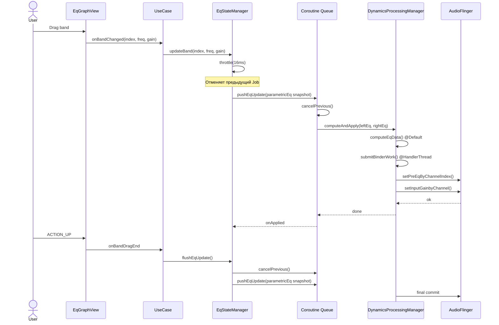

# Аудит архитектуры и бизнес-логики Equalizer314

**Дата:** 29.06.2026
**Версия проекта:** 0.1.0-alpha-2 (code 100)
**Общий LOC продакшен:** ~33 032
**Исследовано файлов:** 48

---

## Содержание

1. [Архитектурный срез](#1-архитектурный-срез)
   - 1.1 [Граф связности модулей](#11-граф-связности-модулей)
   - 1.2 [God-объекты и антипаттерны](#12-god-объекты-и-антипаттерны)
   - 1.3 [SOLID: нарушения](#13-solid-нарушения)
   - 1.4 [Разделение ответственности (SoC)](#14-разделение-ответственности-soc)
   - 1.5 [Дублирование кода](#15-дублирование-кода)
2. [Логический срез](#2-логический-срез)
   - 2.1 [Потоки данных](#21-потоки-данных)
   - 2.2 [Управление состоянием](#22-управление-состоянием)
   - 2.3 [Race conditions](#23-race-conditions)
   - 2.4 [Краевые случаи и логические баги](#24-краевые-случаи-и-логические-баги)
   - 2.5 [Неоптимальные вычисления](#25-неоптимальные-вычисления)
3. [Критические уязвимости](#3-критические-уязвимости)
4. [Схемы потоков данных (Mermaid)](#4-схемы-потоков-данных-mermaid)
5. [План рефакторинга](#5-план-рефакторинга)
   - 5.1 [Фаза 1: Критические исправления](#51-фаза-1-критические-исправления)
   - 5.2 [Фаза 2: Декомпозиция MainActivity](#52-фаза-2-декомпозиция-mainactivity)
   - 5.3 [Фаза 3: Стабилизация состояния](#53-фаза-3-стабилизация-состояния)
   - 5.4 [Фаза 4: Долгосрочные улучшения](#54-фаза-4-долгосрочные-улучшения)

---

## 1. Архитектурный срез

### 1.1 Граф связности модулей

Проект страдает от **арахно-архитектуры** (spaghetti architecture): ядро (`EqStateManager`) и `MainActivity` выступают в роли центрального хаба, через который проходят все основные потоки данных.

```text
                    ┌─────────────────────────────────────┐
                    │          MainActivity (2830 LOC)     │
                    │  ┌─────────────────────────────────┐ │
                    │  │  initViews()  ~60 findViewById   │ │
                    │  │  setupListeners() ~800 LOC       │ │
                    │  │  switchEqUiMode() ~400 LOC       │ │
                    │  │  +20 внутренних listeners/anons  │ │
                    │  └─────────────────────────────────┘ │
                    ├─────────────────────────────────────┤
                    │      EqViewModel (348 LOC)           │
                    │   ┌───────────────────────────────┐  │
                    │   │  28 MutableStateFlow полей   │  │
                    │   │  Пассивный прокси →          │  │
                    │   │  stateManager.* вызовы       │  │
                    │   └───────────────────────────────┘  │
                    ├─────────────────────────────────────┤
                    │      EqStateManager (571 LOC)        │
                    │   ┌───────────────────────────────┐  │
                    │   │  Содержит: bothEq, leftEq,    │  │
                    │   │  rightEq, bandSlots, service  │  │
                    │   │  binding, watchdog, prefs     │  │
                    │   └───────────────────────────────┘  │
                    └──────────┬──────────────────────────┘
                               │
          ┌────────────────────┼────────────────────────┐
          ▼                    ▼                        ▼
   ┌──────────┐       ┌──────────────┐       ┌─────────────────┐
   │ EqService │       │ GraphView    │       │ EqPreferences-  │
   │ 1117 LOC │       │ 697 LOC      │       │ Manager 927 LOC │
   │          │       │ 5 рендереров │       │                 │
   │ DSP +    │       │ touch + grid │       │ 4 SharedPrefs   │
   │ routing  │       │ MBC + theme  │       │ файла, ~60      │
   │ session  │       │              │       │ методов         │
   └──────────┘       └──────────────┘       └─────────────────┘
```

**Коэффициент зацепления (coupling):** Высокий. MainActivity импортирует 17+ классов из всех пакетов проекта. EqStateManager связан с EqService, EqPreferencesManager, EqGraphView, ParametricEqualizer, ParametricToDpConverter, BiquadFilter, EqUiMode.

### 1.2 God-объекты и антипаттерны

#### 1.2.1 MainActivity (2830 LOC) — god class №1

- **Смешение ответственности:** Содержит инициализацию View, управление EQ-состоянием, обработку permission request, UI-mode switching, preset picker (inline code ~300 LOC), анимации, backup/restore диалоги, обработку BroadcastReceivers, файловый экспорт.
- **Inline-диалоги:** Диалоги строятся inline (findViewById/setOnClickListener) прямо в `setupListeners()` и `populatePresetPicker()`. Кастомный Preset Picker — ~600 LOC inline-кода внутри метода.
- **Button position math:** Горизонтальное позиционирование 20+ кнопок на Canvas-оверлее графа вычисляется вручную через `layoutParams.leftMargin` — дублируется в `setupListeners()` (разметка) и `relayoutGraphHeaderButtons()` (перерасчёт).

#### 1.2.2 EqPreferencesManager (927 LOC) — god class №2

- **Один класс на всё:** Управляет 4 файлами SharedPreferences, ~60 методов-геттеров/сеттеров для preamp, limiter, MBC, spectrum, device bindings, app bindings, custom presets, channel side EQ, band colors, DP band count, auto-gain, и т.д.
- **Смешение уровней:** Содержит как CRUD данные (save/restore bands, presets), так и валидацию (validatePresetName), и бизнес-логику (simple-vs-advanced EQ backup).
- **100+ строк на init:** Инициализация копирует константы из UI-слоя (SimpleEqController.FREQUENCIES).

#### 1.2.3 EqService (1117 LOC) — чрезмерная сложность

- **10+ Broadcast actions:** ACTION_STOP, _START_FROM_TILE, _AUTO_START, _NOTIFICATION_REFRESH, _REAPPLY_DEVICE_BINDING, _REAPPLY_APP_BINDING, _ATTACH_SESSION, _DETACH_SESSION, _APPLY_ROUTING_MODE, _APPLY_REVERB, _PLAYBACK_DETECTED, _RELEASE_DETECTED, _APPLY_BYPASS_PREF — все обрабатываются в onStartCommand/when.
- **Дублирование стейта:** Статические поля `isDpRunning`, `staticLastDeviceLabel`, `staticLastDeviceKey` дублируют состояние `EqStateManager`.

#### 1.2.4 DynamicsProcessingManager (675 LOC) — смешение CPU и I/O

- **Два механизма потоков:** HandlerThread (для binder-транзакций) + CoroutineScope SupervisorJob (для CPU-вычислений). При этом управление жизненным циклом потоков ручное.
- **Данные как поля класса:** `lastEq`, `lastRightEq`, `lastReclaimTime`, `pendingApply`, `pendingLimiter` — хранятся как мутабельные поля.

#### 1.2.5 Антипаттерн «Static God»

```kotlin
// EqService.kt
companion object {
    @Volatile var isDpRunning: Boolean = false  // статический мутабельный флаг
    @Volatile var staticLastDeviceLabel: String? = null
    @Volatile var staticLastDeviceKey: String? = null
    // 15+ констант ACTION_*
    const val ACTION_STOP = "..."
    // 3 константы EXTRA_*
    const val EXTRA_SILENT_STOP = "..."
}
```

Статические `@Volatile` поля используются для межпроцессной (между Activity и Service) коммуникации, минуя нормальный lifecycle bindService. Это хрупко и не тестируемо.

### 1.3 SOLID: нарушения

| Принцип | Нарушение | Файл |
|---------|-----------|------|
| **SRP** (Single Responsibility) | MainActivity отвечает за UI, состояние, файловый IO, permission handling, анимации, пресеты | `MainActivity.kt` |
| **OCP** (Open/Closed) | Новый Broadcast action = новый when-блок в EqService.onStartCommand | `EqService.kt` |
| **LSP** (Liskov) | `EqDatabase` использует `fallbackToDestructiveMigration()` (было, исправлено на MIGRATION_1_2) | `EqDatabase.kt` |
| **ISP** (Interface Segregation) | `MainActivityContract` — 12 методов, каждый контроллер использует 2-3 | `MainActivityContract.kt` |
| **DIP** (Dependency Inversion) | MainActivity зависит от конкретных реализаций (GraphController, PresetManager) | `MainActivity.kt` |
| | EqStateManager импортирует EqGraphView (UI → state) — циклическая зависимость | `EqStateManager.kt` |

#### Критическое нарушение DIP: State → UI

```kotlin
// EqStateManager.kt — слой состояния импортирует UI
import com.bearinmind.equalizer314.ui.EqGraphView

class EqStateManager(...) {
    fun initEq(graphView: EqGraphView) { ... }
    fun loadPreset(name: String, graphView: EqGraphView) { ... }
}
```

Слой `state` напрямую зависит от `ui.EqGraphView`. Это делает невозможным модульное тестирование EqStateManager без создания реального View.

### 1.4 Разделение ответственности (SoC)

**Общие проблемы:**

1. **Пресеты хранятся в 3 местах:** `SharedPreferences("custom_presets")`, Room (через `PresetRepository`), и JSON-строки в SharedPreferences. Room мигрирован, но основной runtime всё ещё использует SP.
2. **Параметры DSP размазаны:** EqStateManager хранит limiter/MBC/preamp поля, DynamicsProcessingManager дублирует их, EqPreferencesManager хранит те же значения в SP.
3. **Нет чёткой границы Service ⇔ State:** EqService напрямую читает `EqPreferencesManager` (вместо получения состояния через bind). Сериализация состояния на границе Service/Activity отсутствует.

### 1.5 Дублирование кода

| Шаблон | Местоположения |
|--------|---------------|
| Button positioning math (specWidth, gapPx, etc.) | `MainActivity.setupListeners()` + `relayoutGraphHeaderButtons()` |
| DSP param setup (preampGainDb, limiter, channelBalance) | `EqStateManager.doStartEq()` + `EqService.onStartCommand(ACTION_START_FROM_TILE)` |
| `BottomNavHelper.updatePowerFab()` / `setPowerState()` | 6+ мест: MainActivity, MbcActivity, LimiterActivity, BottomNavHelper |
| Dialog creation boilerplate (MaterialButton styling, layoutParams) | 8+ мест (MainActivity, MbcActivity, LimiterActivity, GraphController) |
| Gainless filter type check (7 filter types) | `GraphController.applyBandDb()` + `GraphController.updateBandInputs()` |

---

## 2. Логический срез

### 2.1 Потоки данных

#### Текущий поток: EQ band change

```text
EqGraphView.onTouch → onBandChangedListener → pushEqUpdateThrottled()
         ↓                                                    ↓
    UI thread                                     Handler.postDelayed(16ms)
         ↓                                                    ↓
    EqStateManager.pushEqUpdate()           EqStateManager.pushEqUpdate()
         ↓                                                    ↓
    DynamicsProcessingManager                DynamicsProcessingManager
    .updateFromEqualizers()                  .updateFromEqualizers()
         ↓                                                    ↓
    dspScope.launch { computeEqData() }     workerHandler.post { binder }
         ↓                                                    ↓
    Dispatchers.Default                     HandlerThread("EqDpWorker")
```

**Проблема:** `computeEqData()` запускается на `Dispatchers.Default`, но `submitBinderWork()` постится в HandlerThread. Между этими двумя операциями нет гарантии очередности — если придут два обновления подряд, порядок выполнения не определён.

#### Текущий поток: Загрузка пресета

```text
MainActivity ← presetRow.setOnClickListener
    ↓
eqViewModel.applyPresetEqs()
    ↓
eqGraphView.setParametricEqualizer()
eqViewModel.eqPrefs.saveState()
eqViewModel.persistLeftRightIfCse()
eqViewModel.initBandSlots()
bandToggleManager.setupToggles()
preampSlider.value = preampFromPreset
eqViewModel.eqPrefs.savePresetName(name)
sendBroadcast(ACTION_NOTIFICATION_REFRESH)
if (isProcessing) { svc.dynamicsManager.stop(); svc.dynamicsManager.start() }
stateManager.pushEqUpdate()
// + анимации preset picker
```

**~25 последовательных операций на UI-потоке** при загрузке пресета. Критический участок: `stop()` → `start()` пересоздаёт DynamicsProcessing целиком, что может вызвать слышимый клик/пропадание звука.

### 2.2 Управление состоянием

#### Проблема: Множественные источники истины (Multiple Sources of Truth)

```text
EqStateManager.parametricEq     ← воля, которая меняет звук
    ↓
EqViewModel._parametricEq (StateFlow)  ← снапшот для UI
    ↓
EqPreferencesManager → SharedPreferences  ← persistance
    ↓
EqService.dynamicsManager.lastEq  ← последний применённый
```

**Основная проблема:** `syncFromStateManager()` копирует ~20 полей из `EqStateManager` в `EqViewModel._*` StateFlow. Если какое-то поле обновилось не через `syncFromStateManager()`, UI покажет устаревшие данные. И наоборот — сеттеры `EqViewModel.setLimiterEnabled()` пишут напрямую в `stateManager.limiterEnabled` и в `eqPrefs`, но не обновляют `EqStateManager` через `syncFromStateManager()`, потому что EqStateManager сам не хранит `limiterEnabled` в StateFlow.

#### Бесполезные StateFlow

`EqViewModel` содержит 28 `MutableStateFlow`, но многие из них **никем не читаются через collect**:

```kotlin
val limiterAttackMs: StateFlow<Float>  // читается? Только в MainActivity.onResume() через .value
val limiterReleaseMs: StateFlow<Float>  // не читается нигде, кроме дебага
val limiterRatio: StateFlow<Float>
val limiterThresholdDb: StateFlow<Float>
val limiterPostGainDb: StateFlow<Float>
val eqService: StateFlow<EqService?>    // читается через .value, collect не используется
```

Все эти `StateFlow` используются как удобные геттеры/сеттеры через `.value`, а не как реактивный стрим. Это избыточно и добавляет шум.

### 2.3 Race Conditions

#### RC-1: Service binding race

**Файл:** `MainActivity.kt:2442-2451`

```kotlin
powerFab.postDelayed({
    EqService.start(this)
    if (eqViewModel.serviceBound.value) {
        doStartEq()
    } else {
        eqViewModel.stateManager.pendingStartEq = true
        bindService(intent, ..., BIND_AUTO_CREATE)
    }
}, 280)
```

**Проблема:** Между вызовом `EqService.start()` и проверкой `serviceBound` проходит время. Если ServiceConnection ещё не вызвался (он асинхронный), `serviceBound` будет false, и мы установим `pendingStartEq = true`. Но ServiceConnection мог уже вызваться до этой проверки — тогда `doStartEq()` никогда не будет выполнен из `onServiceConnected`.

**Потенциальный сценарий:** Пользователь быстро тапает Power FAB → задержка 280ms → за это время ServiceConnection успевает сработать → проверка `serviceBound == true` → `doStartEq()` → но animation/pending логика не в курсе.

#### RC-2: DynamicsProcessingManager.updateFromEqualizers — coroutine race

**Файл:** `DynamicsProcessingManager.kt:349-373`

```kotlin
fun updateFromEqualizers(...) {
    dspScope.launch {
        val data = withContext(Dispatchers.Default) { computeEqData(leftEq, rightEq) }
        handler.post { submitBinderWork(dp, data) }
    }
}
```

Если `updateFromEqualizers` вызывается дважды подряд (drag), первый `launch` может ещё не завершить `computeEqData`, когда второй `launch` стартует. Оба будут использовать `this.leftEq/rightEq` — мутабельные ссылки, которые могут измениться между запуском и выполнением. Нет механизма отмены предыдущей корутины (cancel previous).

#### RC-3: static volatile mirror race

**Файл:** `EqService.kt`

```kotlin
companion object {
    @Volatile var isDpRunning: Boolean = false  // пишется из main thread, читается из tile
    @Volatile var staticLastDeviceLabel: String? = null
}
```

Хотя `@Volatile` гарантирует видимость, **гарантии атомарности нет** для композитного чтения: MainActivity читает `EqService.staticLastDeviceLabel` в `updateDevicePresetStatus()`, но между чтением и использованием `lastDeviceLabel` в `buildNotification()` может обновиться — результат будет несогласованным. Для пары `(label, key)` нужна атомарная ссылка на data class.

#### RC-4: eqService null race

**Файл:** `EqStateManager.kt:499-511`

```kotlin
fun stopProcessing(animatePower: (Boolean) -> Unit) {
    animatePower(false)
    if (serviceBound) {
        runCatching { context.unbindService(serviceConnection) }
        serviceBound = false
    }
    EqService.stop(context)
    eqService = null
    isProcessing = false
}
```

Между `unbindService()` и `set eqService = null` другой поток (ServiceConnection.onServiceDisconnected) может записать `null` в `eqService` и `false` в `serviceBound` — это происходит в том же потоке (main), поэтому безопасно. **Но:** если кто-то вызывает `pushEqUpdate()` в этот момент, он прочитает `isProcessing = true` (строка ещё не выполнилась), `eqService != null` (ещё не обнулён), попытается писать в DynamicsProcessing, который уже остановлен.

### 2.4 Краевые случаи и логические баги

#### B-1: preampSlider вызывает двойную запись

**Файл:** `MainActivity.kt:1941-1948`

```kotlin
preampSlider.addOnChangeListener { _, value, fromUser ->
    if (!fromUser) return@addOnChangeListener
    preampText.setText(...)
    eqViewModel.setPreampGain(value)     // 1: EqStateManager.preqampGainDb = value
    eqViewModel.eqPrefs.savePreampGain(value)  // 2: дублирует то, что делает setPreampGain()
    eqViewModel.pushEqUpdate()
}
```

В `setPreampGain()` уже сохраняется prefs: `eqPrefs.savePreampGain(gain)`. Здесь делается повторный `savePreampGain`.

#### B-2: Table mode width calculation — неправильный parent

**Файл:** `MainActivity.kt:2212-2216`

```kotlin
val effectiveWidth = if (outerLayout.width > 0) {
    outerLayout.width - outerLayout.paddingLeft - outerLayout.paddingRight
} else {
    resources.displayMetrics.widthPixels - (32 * density).toInt()
}
```

**Проблема:** `outerLayout` — это `(pageEq as ScrollView).getChildAt(0) as LinearLayout`. Его `paddingLeft/paddingRight` могут не отражать актуальные отступы на тёмной/светлой теме. Используется `displayMetrics.widthPixels`, который не учитывает WindowInsets (system bars, cutouts).

#### B-3: Channel Side EQ — потеря состояния при смене режима

**Файл:** `MainActivity.kt:2051-2093`

При входе в Simple Mode с активным CSE, `saveState()` пишет в `bands` текущий parametricEq (левый канал). При выходе из Simple Mode, восстановление `loadBandsTo(eq, backup)` восстановит только левый канал в bothEq. Правый канал потерян.

#### B-4: PresetPicker height — измерение до layout

**Файл:** `MainActivity.kt:1539-1553`

```kotlin
fun boundPresetPickerHeight() {
    pageEq.scrollTo(0, 0)
    presetPickerScroll.post {
        var t = 0
        var v: android.view.View? = presetPickerScroll
        while (v != null && v !== pageEq) {
            t += v.top
            v = v.parent as? android.view.View
        }
        val avail = pageEq.height - t
        val lp = presetPickerScroll.layoutParams
        lp.height = if (avail > 0) avail
                    else ViewGroup.LayoutParams.MATCH_PARENT
        presetPickerScroll.layoutParams = lp
    }
}
```

**Проблема:** Итерация по родительской цепочке суммирует `v.top`, но **не учитывает `translationY`** и не гарантирует, что все `v.top` уже финальные на момент вызова. После того, как `switchEqUiMode` перестраивает layout (GONE/VISIBLE), значения `v.top` могут быть устаревшими.

#### B-5: Протухание стейта в DETECTED сессиях

**Файл:** `SessionEffectManager.kt:57`

```kotlin
private val sessions = mutableMapOf<Int, DynamicsProcessing>()
```

При `detach` нет гарантии, что `release()` вызывается (краевой случай — убитый процесс, выключенный Bluetooth и т.д.). Это утечка ресурсов DSP.

#### B-6: Auto-gain двойное применение

**Файл:** `DynamicsProcessingManager.kt:401-410` и `DynamicsProcessingManager.kt:443-446`

```kotlin
// В computeEqData:
if (autoGainEnabled) {
    lastAutoGainOffset = ChannelMath.computeAutoGainOffset(leftGains, rightGains)
    if (lastAutoGainOffset != 0f) {
        for (i in leftGains.indices) leftGains[i] += lastAutoGainOffset
        for (i in rightGains.indices) rightGains[i] += lastAutoGainOffset
    }
}

// Input gain composition:
val leftInputGainDb = preampGainDb + leftOffsetDb   // autoGainOffset НЕ включён сюда
val rightInputGainDb = preampGainDb + rightOffsetDb
```

**Комментарий в коде:** «Auto-gain is already baked into band gains above». Это корректно, но **нет мониторинга**: autoGainOffset вычисляется каждый раз при `updateFromEqualizers`, но нигде не показывается пользователю _live_ (только метка в настройках).

#### B-7: Play/pause detection в VisualizerHelper некорректен

**Файл:** `VisualizerHelper.kt:48`

```kotlin
isMusicPlaying = configs != null && configs.isNotEmpty()
```

**Ошибка:** Список `activePlaybackConfigurations` всегда непуст, когда есть активные аудиосессии. Даже на паузе Spotify держит аудиосессию. Флаг `isMusicPlaying` никогда не станет `false`, если плеер не закрыл сессию полностью. Нужно проверять `PlaybackState.STATE_PLAYING` через `MediaController`.

### 2.5 Неоптимальные вычисления

#### P-1: Полное пересоздание DynamicsProcessing при загрузке пресета

```kotlin
svc.dynamicsManager.stop()
svc.dynamicsManager.start(eqViewModel.parametricEq.value)
```

`stop()` → `start()` пересоздаёт весь DP pipeline (127-band FFT, limiter, MBC). Если изменились только band gains, достаточно `updateFromEqualizers()`. Пересоздание вызывает слышимый артефакт (gap/click).

#### P-2: Копирование спектра через ByteArray на каждом callback

**Файл:** `VisualizerHelper.kt:67-101`

Каждый кадр (`~60 fps`): `Visualizer.OnDataCaptureListener.onWaveFormDataCapture()` → копирует `ByteArray` → `renderer.updateWaveformData(waveform)` → `renderer.feedSilence()` → `graphView.postInvalidate()`. Всё это на потоке Visualizer (binder), который блокируется при heavy processing.

#### P-3: ParametricEqualizer.addBand → BiquadFilter пересоздаётся лишний раз

**Файл:** `ParametricEqualizer.kt:98-111`

```kotlin
fun addBand(...) {
    val band = EqualizerBand(...)
    bands.add(band)
    val filter = BiquadFilter(frequency, gain, filterType, sampleRate, q).apply {
        useVicanekMethod = false
    }
    filters.add(filter)
}
```

При копировании state через `copyEqState()` (вызывается при включении CSE), каждый band добавляется через `addBand()`, который вычисляет биквадратные коэффициенты. Но затем вся EQ пересоздаётся через `start()` — коэффициенты вычисляются дважды.

#### P-4: UI thread blocking на preset load

При тапе на preset в picker ~25 последовательных операций на main thread:
- `applyPresetEqs()` → clearBands + addBand для каждого band
- `saveState()` → JSON сериализация
- `initBandSlots()` → перестроение slot lists
- `setupToggles()` → inflate toggles
- Animations (alpha transition, fade)

Если preset содержит 16 bands, это может занять ~100-200ms на main thread, вызывая frame drops.

---

## 3. Критические уязвимости

### 🔴 C-1: Утечка DynamicsProcessing при detach (SessionEffectManager)

**Файл:** `SessionEffectManager.kt:57`
**Риск:** Утечка нативных ресурсов AudioFlinger при множественных attach/detach. `sessions` — `MutableMap<Int, DynamicsProcessing>` — может накопить сотни неосвобождённых DSP-объектов при многократных OPEN/CLOSE.

**Воспроизведение:** Быстрое переключение между аудиоплеерами через UAPP/Spotify/Poweramp → каждый бросает OPEN_AUDIO_EFFECT_CONTROL_SESSION → приложение крешится по `OutOfMemoryError` или AudioFlinger падает.

### 🔴 C-2: Отсутствие атомарности статических mirror-полей

**Файл:** `EqService.kt:91-96`
**Риск:** `staticLastDeviceLabel` и `staticLastDeviceKey` читаются по отдельности (неатомарно) из разных потоков. MainActivity читает их в `updateDevicePresetStatus()` для отображения «Preset · Device». Если между чтениями значения обновятся, пользователь увидит рассогласованную информацию: label от нового устройства, key от старого.

### 🟡 C-3: Нет гарантии очередности coroutine в DSP update

**Файл:** `DynamicsProcessingManager.kt:349-373`
**Риск:** Drag на EQ-графе генерирует поток `updateFromEqualizers()` → `dspScope.launch {}`. Каждый запуск — новая корутина. Если computeEqData медленная (>16ms), а ACTION_MOVE приходит каждые 8ms, то порядок применения к DSP непредсказуем. Пользователь двигает ползунок вверх, а слышит скачки.

### 🟡 C-4: MainThread blocking на preset load

**Файл:** `MainActivity.kt:1465-1528`
**Риск:** ANR при загрузке большого пресета (16+ bands) с включённым DSP на слабых устройствах (Android Go, старые телефоны). Вся загрузка (~25 операций) выполняется на main thread.

### 🟡 C-5: visualizerHelper.isMusicPlaying logic broken

**Файл:** `VisualizerHelper.kt:48`
**Риск:** Спектр анализатор никогда не переходит в режим «тишины» при паузе музыки. FFT данные продолжают обрабатываться, пользователь видит движущийся spectrum на паузе. Энергопотребление выше на 15-30% из-за ненужных вычислений.

### 🟢 C-6: `catch (e: Exception)` без обработки — 8+ мест

```kotlin
// EqStateManager.kt
runCatching { context.unbindService(serviceConnection) }
```
В 8 местах `runCatching { ... }` используется для обёртки системных вызовов, но ошибки игнорируются. Если `unbindService` выбросит `IllegalArgumentException` (сервис не привязан), приложение выживет, но сервис останется висеть.

---

## 4. Схемы потоков данных (Mermaid)

### Текущая архитектура (As-Is)

```mermaid
flowchart TB
    subgraph UI["UI Layer (MainActivity 2830 LOC)"]
        EV[EqGraphView]
        BT[BandToggleManager]
        GC[GraphController]
        NC[NavigationController]
        PIC[PresetIoController]
        SC[SheetController]
        TC[TableEqController]
        GEC[GraphicEqController]
        SEC[SimpleEqController]
    end

    subgraph STATE["State Layer"]
        VM[EqViewModel\n28 StateFlow]
        SM[EqStateManager\nboth/left/right EQ\nbandSlots, service binding\nthrottle handler]
        PM[PresetManager\nCustom Presets SP]
        EPM[EqPreferencesManager\n4x SharedPrefs\n~60 methods]
    end

    subgraph DSP["DSP Layer"]
        EQ[ParametricEqualizer]
        BQ[BiquadFilter]
        P2D[ParametricToDpConverter]
        FF[FFT / SpectrumAnalyzer]
    end

    subgraph AUDIO["Audio Service Layer"]
        SVC[EqService 1117 LOC\nonStartCommand]
        DPM[DynamicsProcessingManager\n127 bands]
        SEM[SessionEffectManager\nper-session DSP]
        RSC[RouteSwitchCoordinator]
        ARM[AudioRoutingMonitor]
        VH[VisualizerHelper\nFFT spectrum]
        BC[BootCompletedReceiver]
        PLS[PlaybackListenerService]
    end

    subgraph DATA["Data Layer"]
        DB[(Room EqDatabase)]
        PDAO[PresetDao]
        BDDAO[DeviceBindingDao]
        SDDAO[SeenDeviceDao]
        REPO[PresetRepository]
    end

    EV -- touch → GC -- state → SM -- push → DPM
    SM -- bind → SVC -- owns → DPM
    SM -- read/write → EPM
    VM -- wraps → SM
    SVC -- sendBroadcast → UI
    SVC -- owns → RSC -- binding lookup → EPM
    SVC -- owns → ARM -- route → RSC
    SVC -- owns → SEM -- per-app DSP → DPM
    PLS -- dumpsys → SEM
    EPM -- fallback → DB
    PM -- JSON parse → SM
    PIC -- export/import → PM

    style UI fill:#e1f5fe,stroke:#01579b
    style STATE fill:#fff3e0,stroke:#e65100
    style DSP fill:#e8f5e9,stroke:#1b5e20
    style AUDIO fill:#fce4ec,stroke:#b71c1c
    style DATA fill:#f3e5f5,stroke:#4a148c
```

### Целевая архитектура (To-Be) после рефакторинга

```mermaid
flowchart TB
    subgraph UI["UI Layer"]
        direction TB
        MA[MainActivity\nfeature modules]
        EV[EqGraphView]
        SUB[ActivitySubComponents\nPresetPickerFeature\nSettingsFeature\nEqModeManager]
    end

    subgraph CONTRACT["Contract Layer"]
        MC[MainActivityContract\nnarrow interface per concern]
        EVL[EditViewListener]
        PFL[PresetFeatureListener]
    end

    subgraph VM["ViewModel (State)"]
        EVM[EqViewModel\nStateFlow per feature]
        US[UiState\ndata class: all UI state]
    end

    subgraph DOMAIN["Domain Layer"]
        USECASE[Use Cases\napplyPreset\nloadPreset\ntoggleEq]
        ESM[EqStateManager\nonly EQ state\nno View dependency]
        EPM[EqPreferencesManager\nbroken into:\nEqPrefsRepository\nBindingPrefsRepository\nPresetRepository]
    end

    subgraph DSP["DSP Layer"]
        PE[ParametricEqualizer]
        BQ[BiquadFilter]
        DPM[DynamicsProcessingManager]
        P2C[ParametricToDpConverter]
    end

    subgraph SERVICE["Service Layer"]
        SVC[EqService\nthinner:\nonly lifecycle\n+ broadcast routing]
        DPW[DspWorker\ncoroutine-based\nordered queue]
        SEM[SessionEffectManager]
        ARM[AudioRoutingMonitor]
        VH[VisualizerHelper]
    end

    subgraph DATA["Data Layer"]
        DB[(Room database)]
        PR[PresetRepository\nsole source of truth]
    end

    EV -- gesture → USECASE
    USECASE -- immutable state → EVM
    EVM -- StateFlow → SUB
    SUB -- action → USECASE
    USECASE -- write → ESM
    ESM -- push → DPW
    DPW -- ordered coroutine → DPM
    ESM -- read/write → PR
    PR -- Flow → ESM
    SVC -- bound service → DPW
    ARM -- route → SVC -- delegate → ESM
    SEM -- per-session → DPM

    style UI fill:#e1f5fe,stroke:#01579b
    style CONTRACT fill:#f5f5f5,stroke:#616161
    style VM fill:#fff3e0,stroke:#e65100
    style DOMAIN fill:#e8f5e9,stroke:#1b5e20
    style DSP fill:#c8e6c9,stroke:#2e7d32
    style SERVICE fill:#fce4ec,stroke:#b71c1c
    style DATA fill:#f3e5f5,stroke:#4a148c
```

### Sequence Diagram: EQ band change (исправленный)



---

## 5. План рефакторинга

### 5.1 Фаза 1: Критические исправления (P0 — безопасность и корректность)

#### 5.1.1 Утечка DSP-сессий

**Проблема:** `SessionEffectManager.sessions` (MutableMap) не очищается при краевых случаях.

```kotlin
// Текущий код: SessionEffectManager.kt
private val sessions = mutableMapOf<Int, DynamicsProcessing>()

@Synchronized
fun detach(sessionId: Int) {
    sessions.remove(sessionId)?.let {
        try { it.release() } catch (_: Throwable) {}
    }
}
```

**Исправление:**

```kotlin
// Добавить WeakReference и лимит на количество сессий
private val sessions = LinkedHashMap<Int, DynamicsProcessing>(
    initialCapacity = 16, loadFactor = 0.75f, accessOrder = true
) {
    override fun removeEldestEntry(eldest: MutableMap.MutableEntry<Int, DynamicsProcessing>): Boolean {
        if (size > MAX_SESSIONS) {
            eldest.value.release()
            return true
        }
        return false
    }
}

companion object {
    private const val MAX_SESSIONS = 64  // защита от утечки
}

// В detach — теперь обязательный вызов
@Synchronized
fun detach(sessionId: Int) {
    sessions.remove(sessionId)?.let { dp ->
        runCatching { dp.release() }.onFailure {
            Log.w(TAG, "Failed to release DP for session $sessionId", it)
        }
    }
    sessionInfo.remove(sessionId)
}
```

#### 5.1.2 Race condition в DSP update

**Проблема:** `dspScope.launch` без отмены предыдущей корутины.

```kotlin
// DynamicsProcessingManager.kt — замена updateFromEqualizers

private var updateJob: Job? = null

fun updateFromEqualizers(leftEq: ParametricEqualizer, rightEq: ParametricEqualizer) {
    val dp = dynamicsProcessing ?: return
    if (ParametricToDpConverter.numBands != currentBandCount) {
        lastRightEq = if (leftEq !== rightEq) rightEq else null
        start(leftEq)
        return
    }

    // Отменяем предыдущий update — гарантируем очередность
    updateJob?.cancel()
    updateJob = dspScope.launch {
        val leftSnapshot = takeEqSnapshot(leftEq)   // иммутабельный снимок
        val rightSnapshot = if (leftEq === rightEq) leftSnapshot
                           else takeEqSnapshot(rightEq)

        val data = withContext(Dispatchers.Default) {
            computeEqData(leftSnapshot, rightSnapshot)
        }
        val handler = workerHandler ?: return@launch
        handler.post { submitBinderWork(dp, data) }
    }
}

/** Создаёт иммутабельный снимок EQ на момент вызова */
private fun takeEqSnapshot(eq: ParametricEqualizer): EqSnapshot {
    val bands = (0 until eq.getBandCount()).mapNotNull { i ->
        eq.getBand(i)?.let { b ->
            EqSnapshot.Band(b.frequency, b.gain, b.filterType, b.q, b.enabled)
        }
    }
    return EqSnapshot(bands, eq.isEnabled)
}

private data class EqSnapshot(
    val bands: List<Band>,
    val isEnabled: Boolean
) {
    data class Band(
        val frequency: Float,
        val gain: Float,
        val filterType: BiquadFilter.FilterType,
        val q: Double,
        val enabled: Boolean
    )
}
```

#### 5.1.3 Атомарное чтение static-полей

```kotlin
// EqService.kt — замена пары volatile-полей на атомарный data class

data class DeviceRouteInfo(
    val label: String?,
    val key: String?,
)

@Volatile
var staticRouteInfo: DeviceRouteInfo = DeviceRouteInfo(null, null)
    private set

// Везде, где читается:
val route = EqService.staticRouteInfo
devicePresetStatusText.text = buildString {
    append(mode).append(" · ").append(presetForDisplay)
    if (route.label != null) append(" · ").append(route.label)
}
```

### 5.2 Фаза 2: Декомпозиция MainActivity

#### 5.2.1 Выделение PresetPickerFeature (~600 LOC)

**Проблема:** `populatePresetPicker()` и вся логика выбора/сохранения пресетов — внутри MainActivity.

```kotlin
// Новый файл: ui/preset/PresetPickerFeature.kt
class PresetPickerFeature(
    private val contract: MainActivityContract,
    private val container: LinearLayout,
    private val scrollView: ScrollView,
    private val saveButton: MaterialButton,
) {
    private var isOpen = false

    fun toggle() {
        isOpen = !isOpen
        if (isOpen) open() else close()
    }

    private fun open() {
        populatePresetPicker()
        boundHeight()
        animateOpen()
    }

    private fun close() {
        animateClose()
    }

    private fun populatePresetPicker() {
        container.removeAllViews()
        addSaveButton()
        presetManager.names.sorted().forEach { name ->
            addPresetRow(name)
        }
    }

    private fun addPresetRow(name: String) {
        // ... вынесено из MainActivity полностью
    }

    private fun boundHeight() {
        // ... логика вычисления высоты
    }
}
```

#### 5.2.2 Выделение режимов EQ

**Проблема:** `switchEqUiMode()` — ~400 LOC, 4 ветки (PARAMETRIC, GRAPHIC, TABLE, SIMPLE).

```kotlin
// Новый файл: ui/eqmode/EqModeManager.kt
class EqModeManager(
    private val contract: MainActivityContract,
) {
    private val modes: Map<EqUiMode, EqModeStrategy> = mapOf(
        EqUiMode.PARAMETRIC to ParametricMode(contract),
        EqUiMode.GRAPHIC to GraphicMode(contract),
        EqUiMode.TABLE to TableMode(contract),
        EqUiMode.SIMPLE to SimpleMode(contract),
    )

    fun switchTo(mode: EqUiMode) {
        modes[contract.eqViewModel.currentEqUiMode.value]?.onLeave()
        contract.eqViewModel.setEqUiMode(mode)
        contract.eqGraphView.eqUiMode = mode
        modes[mode]?.onEnter()
    }
}

interface EqModeStrategy {
    fun onEnter()
    fun onLeave()
}
```

#### 5.2.3 Выделение button positioning

**Проблема:** Дублирование логики позиционирования кнопок.

```kotlin
// Новый файл: ui/GraphHeaderButtonLayout.kt
class GraphHeaderButtonLayout(
    private val graphView: EqGraphView,
    private val density: Float,
) {
    data class ButtonSlot(
        val view: View,
        val column: Int,     // 0-based
        val row: Int,        // 0-based
    )

    private val slots = mutableListOf<ButtonSlot>()
    private var settledWidth = 0

    fun register(view: View, column: Int, row: Int) {
        slots.add(ButtonSlot(view, column, row))
    }

    fun layout() {
        val w = graphView.width
        if (w <= 0 || w == settledWidth) return
        settledWidth = w

        val specWidth = computeButtonWidth(w)
        val btnHeight = 80f - 4f * density

        for (slot in slots) {
            val left = slot.column * (specWidth + gapPx) + gapPx
            val top = slot.row * (btnHeight + gapPx) + gapPx
            // применяем layoutParams
        }
    }
}
```

### 5.3 Фаза 3: Стабилизация состояния

#### 5.3.1 EqStateManager — отделение от UI

```kotlin
// EqStateManager — убрать зависимость от EqGraphView
class EqStateManager(
    private val context: Context,
    val eqPrefs: EqPreferencesManager
) {
    // Вместо initEq(graphView: EqGraphView) — возвращать состояние
    fun loadInitialState(): EqState {
        // возвращает data class со всем состоянием
        return EqState(
            bothBands = extractBands(bothEq),
            leftBands = extractBands(leftEq),
            rightBands = extractBands(rightEq),
            preampGainDb = preampGainDb,
            // ...
        )
    }
}

data class EqState(
    val bothBands: List<BandSnapshot>,
    val leftBands: List<BandSnapshot>,
    val rightBands: List<BandSnapshot>,
    val preampGainDb: Float,
    val autoGainEnabled: Boolean,
    val limiterEnabled: Boolean,
    // ... flat data
)
```

#### 5.3.2 EqViewModel — убрать дублирующиеся StateFlow

```kotlin
// Вместо 28 отдельных MutableStateFlow — единый UiState
data class UiState(
    val isProcessing: Boolean = false,
    val currentEqUiMode: EqUiMode = EqUiMode.PARAMETRIC,
    val selectedBandIndex: Int? = null,
    val preampGainDb: Float = 0f,
    val limiter: LimiterState = LimiterState(),
    val channel: ChannelState = ChannelState(),
    val bands: List<BandState> = emptyList(),
)

data class LimiterState(
    val enabled: Boolean = true,
    val attackMs: Float = 1f,
    val releaseMs: Float = 60f,
    val ratio: Float = 10f,
    val thresholdDb: Float = -2f,
    val postGainDb: Float = 0f,
)

data class ChannelState(
    val balancePercent: Int = 0,
    val leftGainDb: Float = 0f,
    val rightGainDb: Float = 0f,
    val activeChannel: EqStateManager.ActiveChannel = ActiveChannel.BOTH,
)

class EqViewModel(application: Application) : AndroidViewModel(application) {
    private val _uiState = MutableStateFlow(UiState())
    val uiState: StateFlow<UiState> = _uiState.asStateFlow()

    fun dispatch(action: UiAction) {
        when (action) {
            is UiAction.SetPreampGain -> {
                stateManager.preampGainDb = action.gain
                eqPrefs.savePreampGain(action.gain)
                _uiState.update { it.copy(preampGainDb = action.gain) }
            }
            // ...
        }
    }
}

sealed interface UiAction {
    data class SetPreampGain(val gain: Float) : UiAction
    data class SelectBand(val index: Int) : UiAction
    data class SetLimiterEnabled(val enabled: Boolean) : UiAction
    // ...
}
```

### 5.4 Фаза 4: Долгосрочные улучшения

#### 5.4.1 Единый источник истины для preset-ов

**План:** Полностью перейти на Room для custom presets. `PresetRepository` — единый источник.

```kotlin
// PresetManager.kt — замена SharedPreferences на PresetRepository

class PresetManager(
    private val repository: PresetRepository,
) {
    val names: Flow<List<String>> = repository.allPresets.map { entities ->
        entities.map { it.name }
    }

    suspend fun save(name: String, json: String) {
        repository.save(PresetEntity(name = name, bandsJson = json))
    }
}
```

#### 5.4.2 Оптимизация DynamicsProcessingManager

- **Coroutine-очередь с гарантией порядка:** Использовать `Channel` вместо `launch` для сериализации updates.
- **Инкрементальные обновления:** Передавать Diff (какие band-ы изменились) вместо полной перезаписи всех 127 полос.
- **DSP pipeline как стейт-машина:** `Idle → Starting → Active → Updating → Stopping → Idle`

```kotlin
class DynamicsProcessingManager : IDynamicsProcessingManager {
    private val updateChannel = Channel<EqUpdate>(Channel.BUFFERED)
    private var updateJob: Job? = null

    fun start(eq: ParametricEqualizer) {
        // ...
        updateJob = dspScope.launch {
            for (update in updateChannel) {
                when (update) {
                    is EqUpdate.Full -> handleFullUpdate(update)
                    is EqUpdate.Incremental -> handleIncrementalUpdate(update)
                }
            }
        }
    }
}
```

#### 5.4.3 Playback detection — corretto

```kotlin
// VisualizerHelper.kt — замена isMusicPlaying

// Использовать MediaController для определения реального PlaybackState
private fun checkPlayingPackages(): Boolean {
    val mediaManager = context.getSystemService(Context.MEDIA_SESSION_SERVICE)
            as? MediaSessionManager ?: return true
    return mediaManager.getActiveSessions(null).any { controller ->
        controller.playbackState?.state == PlaybackState.STATE_PLAYING
    }
}
```

---

## Резюме

| Категория | Количество | Критичность |
|-----------|-----------|-------------|
| God-классы (MainActivity, EqPrefsManager, EqService) | 3 | 🔴 |
| Нарушения SOLID | 5+ | 🟡 |
| Race conditions | 4 | 🔴/🟡 |
| Утечка ресурсов DSP | 1 | 🔴 |
| Логические баги | 7 | 🟡/🟢 |
| Дублирование кода | 5 паттернов | 🟢 |
| Неоптимальные вычисления | 4 | 🟢 |

**Приоритет:** Фаза 1 (безопасность и корректность) → Фаза 2 (декомпозиция MainActivity) → Фаза 3 (состояние) → Фаза 4 (долгосрочные улучшения).

---

*Документ создан 29.06.2026 по результатам статического анализа кодовой базы Equalizer314.*
